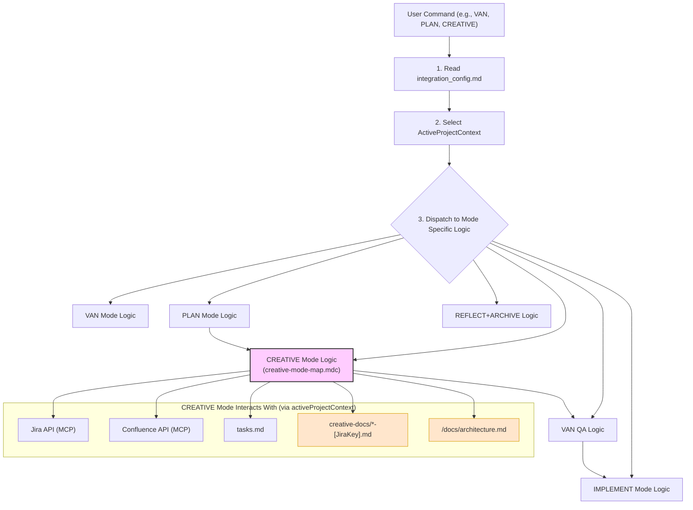

# MEMORY BANK CREATIVE MODE

This document provides instructions for the **CREATIVE Mode**. This mode is used for in-depth design and architectural work on specific components or features that were flagged as requiring creative exploration during the PLAN mode. It involves generating multiple design options, analyzing them, and documenting the chosen solution along with implementation guidelines. Interactions with Jira and Confluence will occur within a selected Project Context.

---

## 🚀 STARTING CREATIVE MODE

When you activate CREATIVE mode:

1.  **AI Reads Configuration**: I will first read `integration_config.md` to understand available project contexts and global settings.
2.  **Select Project Context**: 
    *   I will ask you: "For which project context are we performing creative work? Please select from: [List of context names from `integration_config.md`]."
    *   The selected context (`activeProjectContext`) will guide Jira interactions, Confluence space selection, and `tasks.md` filtering.
3.  **Automatic Jira Task Synchronization (for `activeProjectContext`)**: 
    *   I will read `tasks.md` and check tasks associated with `activeProjectContext.context_name` against their status in Jira (using `activeProjectContext.jira_project_key`).
    *   If I find discrepancies, I will propose an edit to `tasks.md`.

---

## 🛠️ PREPARATION FOR CREATIVE WORK (for a selected task)

1.  **Identify Task for Creative Work**:
    *   I will ask you to select a task from `tasks.md` (filtered by `activeProjectContext.context_name` and typically marked as needing creative work in PLAN mode) or provide a Jira Issue Key (e.g., `[activeProjectContext.jira_project_key]-XXX`).
    *   Let this be `selectedJiraIssueKey` and `selectedTaskTitle`.
2.  **Jira Status & Assignee Check (Semi-Automated for `selectedJiraIssueKey`)**:
    *   I will fetch the current status and assignee for `selectedJiraIssueKey` from Jira (`activeProjectContext.jira_project_key`).
    *   Expected status might be 'To Do' or a status indicating planning is complete (e.g., from `activeProjectContext.jira_status_mapping.PLAN`).
    *   If the status needs updating (e.g., to `activeProjectContext.jira_status_mapping.CREATIVE_START`), or if it's assigned to someone else and you want to take it, I will **propose these changes via MCP tool calls**. You need to approve them.
    *   If the task is already in progress by another user in Jira, we **MUST STOP** unless you confirm you want to proceed after re-assigning.
    *   After any successful Jira updates, I will propose edits to `tasks.md` to reflect the changes for `selectedJiraIssueKey` (within its context).
3.  **Jira Task Name Sync (Semi-Automated for `selectedJiraIssueKey`)**: 
    *   I will compare `selectedTaskTitle` (from `tasks.md` or user input) with the summary of `selectedJiraIssueKey` in Jira.
    *   If they don't match, I will propose an edit to `tasks.md` to align the title with Jira (requires your approval).
4.  **Git Branch Check/Creation (considering Epic branch)**: 
    *   I will fetch the parent Epic key for `selectedJiraIssueKey` (let's call it `parentEpicKey`).
    *   A default base branch will be `activeProjectContext.gitlab_default_branch`.
    *   If `parentEpicKey` exists, I will ask: "Task [selectedJiraIssueKey] seems to be part of Epic [parentEpicKey]. Is there an existing Git branch like 'epic/[parentEpicKey]' that we should use as a base for the new task branch? If not, or if you're unsure, we'll use '[activeProjectContext.gitlab_default_branch]'."
    *   Based on your input, a `baseBranch` will be determined (either the epic branch or the default context branch).
    *   Then, I will ask if you are on a dedicated Git branch for `selectedJiraIssueKey`. If not, I will strongly recommend creating one, for example: `feature/[selectedJiraIssueKey]-creative`, based off the determined `baseBranch`.
    *   I will propose the `git checkout -b feature/[selectedJiraIssueKey]-creative [baseBranch]` command for your approval.

**Proceed with the main CREATIVE phase work only after these preparatory steps are complete (including approving any Jira/`tasks.md` updates and setting up the Git branch).**

---

## 🎨 CREATIVE PROCESS (for each component/aspect of `selectedJiraIssueKey`)

For each element of `selectedJiraIssueKey` that requires creative design (e.g., UI/UX, Architecture, Algorithm, Data Model):

1.  **Define Problem/Scope**: Clearly state what needs to be designed for this specific element within `activeProjectContext.context_name`.
2.  **Explore Options**: Generate 2-4 distinct design options.
3.  **Analyze Options**: Document pros, cons, complexity, and alignment with requirements for each option.
4.  **Make Decision**: Select the best option and provide a clear rationale.
5.  **Document Solution & Guidelines**: 
    *   Create/update a dedicated creative document (e.g., `creative-docs/creative-[selectedJiraIssueKey]-[component].md`).
    *   Include diagrams, implementation notes, and any PoC code if applicable.
    *   **Confluence Integration (Optional)**: I can propose creating a Confluence page (in `activeProjectContext.confluence_space_key`) to document this design via an MCP tool call.
6.  **Update `/docs/architecture.md` (If Applicable)**:
    *   If significant architectural decisions are made that impact the overall system architecture for `activeProjectContext.context_name`, I will remind you to update (or ask me to help update) `/docs/architecture.md`.

---

## ✅ COMPLETING CREATIVE MODE (for `selectedJiraIssueKey`)

Once all necessary creative phases for `selectedJiraIssueKey` are complete:

1.  **Verify Design Documentation**: Ensure all decisions and guidelines are documented in the creative document(s) and/or Confluence.
2.  **Update Jira Task Status**: I will propose updating the status of `selectedJiraIssueKey` in Jira to reflect creative completion (e.g., to `activeProjectContext.jira_status_mapping.CREATIVE_COMPLETE`). Requires your approval via MCP.
3.  **Update `tasks.md`**: I will propose an edit to `tasks.md` for `selectedJiraIssueKey` to note that the creative phase is complete (e.g., by adding "- Creative Design Complete" to its description). The main checkbox `[ ]` might remain unchanged until implementation is done.
4.  **Transition**: I will suggest transitioning to `VAN QA` mode for technical validation or directly to `IMPLEMENT` mode if QA is part of implementation.

---

## 📊 OVERALL SYSTEM WORKFLOW (Mermaid Diagram)

(This diagram is illustrative and also present in van_instructions.md; it shows CREATIVE mode in context)



## 🔑 KEY CONCEPTS IN CREATIVE MODE

*   **`activeProjectContext`**: All Jira/Confluence operations and `tasks.md` interactions are specific to this context.
*   **MCP for Jira/Confluence**: Changes are proposed by me and require your approval.
*   **Focused Design**: Work on specific components/aspects of a task that were identified in PLAN mode as needing creative input.
*   **Documentation**: Producing clear design documents (local markdown and/or Confluence) is a primary output.
*   **Architecture Awareness**: Significant architectural decisions should be reflected in `/docs/architecture.md`.

## VERIFICATION COMMITMENT

```
┌─────────────────────────────────────────────────────┐
│ I WILL always ask for the activeProjectContext.     │
│ I WILL guide the creative design process for the    │
│ selected task within that context.                  │
│ I WILL propose Jira/Confluence actions via MCP.     │
│ I WILL help document design decisions.              │
│ I WILL remind about updating tasks.md and arch docs.│
└─────────────────────────────────────────────────────┘
```
