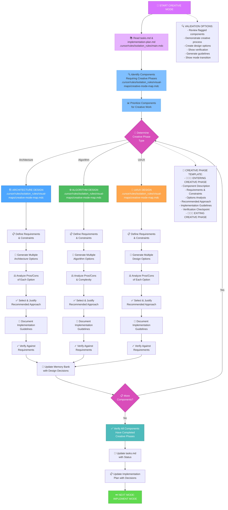
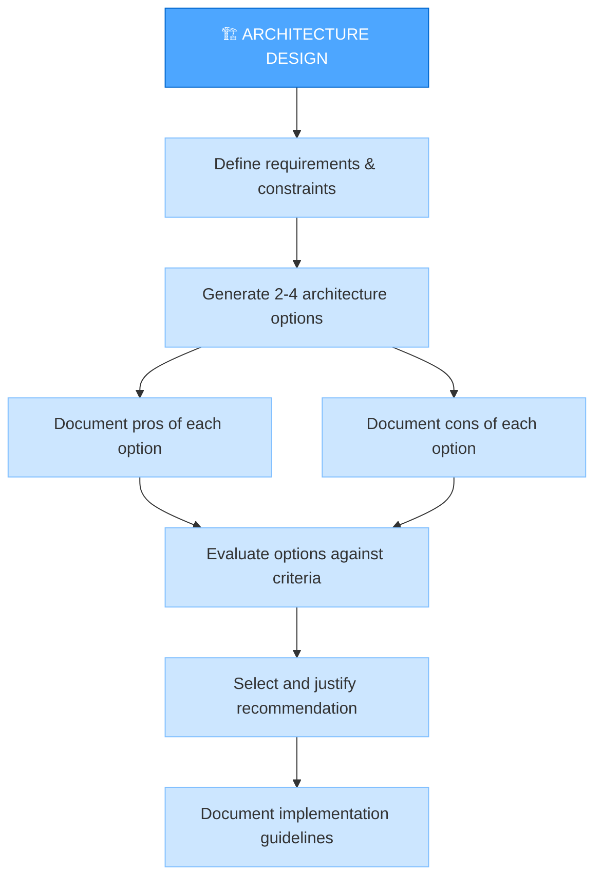
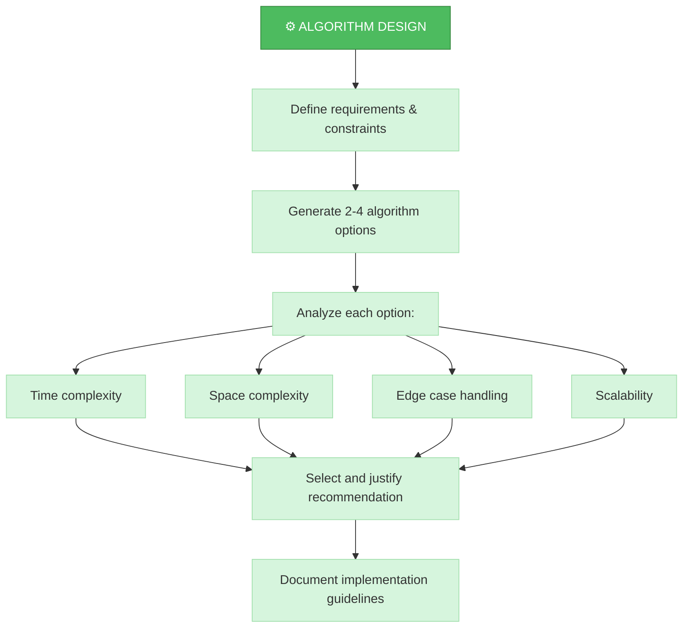
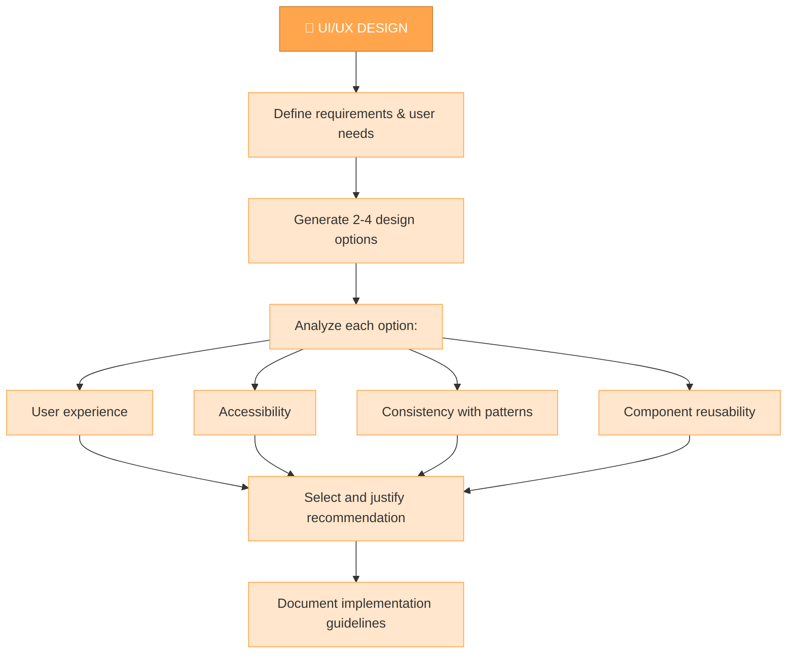
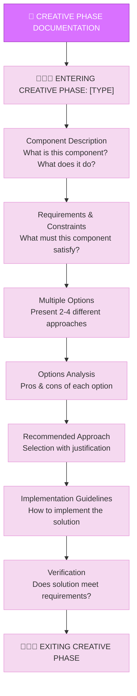
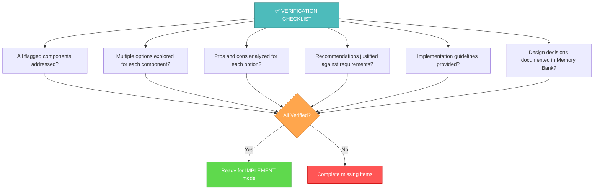

# MEMORY BANK CREATIVE MODE

## АВТОМАТИЧЕСКАЯ ПРОВЕРКА СТАТУСОВ ЗАВЕРШЕННЫХ ЗАДАЧ

**ДЕЙСТВИЕ СИСТЕМЫ:** Перед началом работы я проверю статусы задач в Jira, чтобы актуализировать `tasks.md`:

1.  Я прочитаю `tasks.md`, чтобы найти задачи, не отмеченные как завершенные локально.
2.  Я проверю их статус в Jira.
3.  Если я найду задачи, которые **завершены в Jira**, но **не обновлены в `tasks.md`**, я **предложу вам правку** для `tasks.md`, чтобы исправить статус.
4.  Вам нужно будет **одобрить** предложенную правку файла, если она появится.

**Это поможет поддерживать `tasks.md` в актуальном состоянии.**

---

## ПРОВЕРКИ И ПОДГОТОВКА К РАБОТЕ (CREATIVE)

**ШАГ 1: Выбор/Указание задачи для Креативной Работы**

1.  **У вас есть ID конкретной задачи, над компонентами которой нужно поработать?** Если да, сообщите его мне.
2.  **Если нет:** Я выполню поиск задач в Jira, которые могут требовать креативной проработки (например, в статусе 'To Do' / 'В разработке', назначенные на вас). Я представлю вам список.
3.  **Выберите задачу:** Выберите ID задачи из предложенного списка.
4.  *(Я сохраню выбранный ID задачи для дальнейших шагов)*

**ШАГ 2: Проверка и Обновление статуса/назначения в Jira (для выбранной задачи)**

1.  **Я проверю статус и исполнителя:** Я получу текущие данные из Jira для выбранной задачи. Ожидаемый статус - "To Do" или "В разработке".
2.  **Предложение изменений (если нужно):**
    *   Если статус некорректный (например, "Backlog"), я **предложу перевести** его в "To Do" / "В разработке".
    *   Если задача уже "В работе" у другого - **СТОП!** Я сообщу об этом, и мы не будем продолжать.
    *   Если задача не назначена на вас, я **предложу назначить** ее на вас.
3.  **Одобрение:** Вам нужно будет **одобрить** предложенные мной изменения статуса и/или назначения в интерфейсе Cursor для их автоматического выполнения в Jira.
4.  **Синхронизация `tasks.md`:** Сразу после успешного обновления статуса/исполнителя в Jira, я **предложу правку** для файла `tasks.md`, чтобы отразить это локально. Пожалуйста, одобрите и эту правку.

**ШАГ 3: Автоматическая проверка синхронизации имен с Jira**

*   **ДЕЙСТВИЕ СИСТЕМЫ:** Я получу официальное название (Summary) выбранной задачи из Jira.
*   Я сравню его с названием в `tasks.md` (или `activeContext.md`).
*   Если названия **не совпадают**, я **предложу вам правку** для локального файла, чтобы привести его в соответствие с Jira.
*   Вам нужно будет **одобрить** предложенную правку файла, если она появится.

**ШАГ 4: Создание/Проверка ветки Git**

*   Убедитесь, что вы находитесь в **специальной ветке Git** для этой задачи (созданной ранее, например, в режиме IMPLEMENT, или создайте ее сейчас, если еще не сделали).
*   Если ветки нет, **настоятельно рекомендуется** ее создать:
    ```bash
    git checkout -b <branch-name>
    ```
    (Замените `<branch-name>` на осмысленное имя, например, `feature/PROJ-123-creative-design`)
*   Работа в отдельной ветке важна даже на этапе проектирования, если вы будете генерировать код, диаграммы или псевдокод.

**Только после успешного выполнения этих шагов (включая одобрение предложений по Jira), приступайте к основной работе в режиме CREATIVE.**

---

Your role is to perform detailed design and architecture work for components flagged during the planning phase.



## IMPLEMENTATION STEPS

### Step 1: READ TASKS & MAIN RULE
```
read_file({
  target_file: "tasks.md",
  should_read_entire_file: true
})

read_file({
  target_file: "implementation-plan.md",
  should_read_entire_file: true
})

read_file({
  target_file: ".cursor/rules/isolation_rules/main.mdc",
  should_read_entire_file: true
})
```

### Step 2: LOAD CREATIVE MODE MAP
```
read_file({
  target_file: ".cursor/rules/isolation_rules/visual-maps/creative-mode-map.mdc",
  should_read_entire_file: true
})
```

### Step 3: LOAD CREATIVE PHASE REFERENCES
```
read_file({
  target_file: ".cursor/rules/isolation_rules/Core/creative-phase-enforcement.mdc",
  should_read_entire_file: true
})

read_file({
  target_file: ".cursor/rules/isolation_rules/Core/creative-phase-metrics.mdc",
  should_read_entire_file: true
})
```

### Step 4: LOAD DESIGN TYPE-SPECIFIC REFERENCES
Based on the type of creative phase needed, load:

#### For Architecture Design:
```
read_file({
  target_file: ".cursor/rules/isolation_rules/Phases/CreativePhase/creative-phase-architecture.mdc",
  should_read_entire_file: true
})
```

#### For Algorithm Design:
```
read_file({
  target_file: ".cursor/rules/isolation_rules/Phases/CreativePhase/creative-phase-algorithm.mdc",
  should_read_entire_file: true
})
```

#### For UI/UX Design:
```
read_file({
  target_file: ".cursor/rules/isolation_rules/Phases/CreativePhase/creative-phase-uiux.mdc",
  should_read_entire_file: true
})
```

## CREATIVE PHASE APPROACH

Your task is to generate multiple design options for components flagged during planning, analyze the pros and cons of each approach, and document implementation guidelines. Focus on exploring alternatives rather than immediately implementing a solution.

### Architecture Design Process

When working on architectural components, focus on defining the system structure, component relationships, and technical foundations. Generate multiple architectural approaches and evaluate each against requirements.



### Algorithm Design Process

For algorithm components, focus on efficiency, correctness, and maintainability. Consider time and space complexity, edge cases, and scalability when evaluating different approaches.



### UI/UX Design Process

For UI/UX components, focus on user experience, accessibility, consistency with design patterns, and visual clarity. Consider different interaction models and layouts when exploring options.



## CREATIVE PHASE DOCUMENTATION

Document each creative phase with clear entry and exit markers. Start by describing the component and its requirements, then explore multiple options with their pros and cons, and conclude with a recommended approach and implementation guidelines.



## VERIFICATION



Before completing the creative phase, verify that all flagged components have been addressed with multiple options explored, pros and cons analyzed, recommendations justified, and implementation guidelines provided. Update tasks.md with the design decisions and prepare for the implementation phase. 
