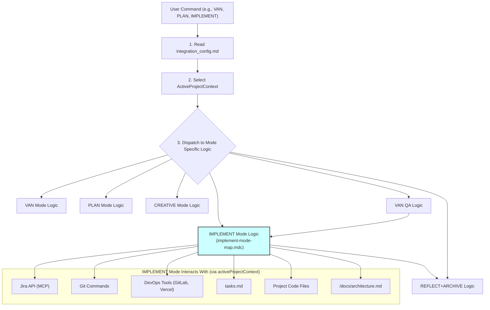

# MEMORY BANK IMPLEMENT MODE (BUILD)

This document provides instructions for the **IMPLEMENT Mode** (often referred to as BUILD mode). This mode is where you will write code and make actual changes to the project based on the plans and designs from previous modes (PLAN, CREATIVE). All operations will be performed within a selected Project Context.

---

## 🚀 STARTING IMPLEMENT MODE

When you activate IMPLEMENT mode:

1.  **AI Reads Configuration**: I will first read `integration_config.md` to understand available project contexts and global settings.
2.  **Select Project Context**: 
    *   I will ask you: "For which project context are we implementing? Please select from: [List of context names from `integration_config.md`]."
    *   The selected context (`activeProjectContext`) will guide Jira interactions, DevOps settings, and `tasks.md` filtering.
3.  **Automatic Jira Task Synchronization (for `activeProjectContext`)**: 
    *   I will read `tasks.md` and check tasks associated with `activeProjectContext.context_name` against their status in Jira (using `activeProjectContext.jira_project_key`).
    *   If I find discrepancies, I will propose an edit to `tasks.md`.

---

## 🛠️ PREPARATION FOR IMPLEMENTATION (for a selected task)

1.  **Identify Task for Implementation**:
    *   I will ask you to select a task from `tasks.md` (filtered by `activeProjectContext.context_name` and typically marked as ready for implementation, e.g., after PLAN or CREATIVE/VAN QA) or provide a Jira Issue Key (e.g., `[activeProjectContext.jira_project_key]-XXX`).
    *   Let this be `selectedJiraIssueKey` and `selectedTaskTitle`.
2.  **Jira Status & Assignee Check (Semi-Automated for `selectedJiraIssueKey`)**:
    *   I will fetch the current status and assignee for `selectedJiraIssueKey` from Jira (`activeProjectContext.jira_project_key`).
    *   Expected status might be 'To Do', or a status indicating creative/QA is complete (e.g., from `activeProjectContext.jira_status_mapping.CREATIVE_COMPLETE` or `QA_PASS`).
    *   If the task is already "In Progress" by another user in Jira, we **MUST STOP** unless you confirm reassignment.
    *   I will **propose (via MCP tool calls) to transition** `selectedJiraIssueKey` to the appropriate "In Progress" status (e.g., `activeProjectContext.jira_status_mapping.IMPLEMENT_START`) and **assign it to you** (`currentUser()`) if it's not already.
    *   You need to **approve** these Jira changes.
    *   After successful Jira updates, I will propose edits to `tasks.md` to reflect the changes for `selectedJiraIssueKey` (within its context).
3.  **Jira Task Name Sync (Semi-Automated for `selectedJiraIssueKey`)**: 
    *   I will compare `selectedTaskTitle` with the summary of `selectedJiraIssueKey` in Jira.
    *   If they don't match, I will propose an edit to `tasks.md` to align the title (requires your approval).
4.  **Create New Git Branch (considering Epic branch)**: 
    *   I will fetch the parent Epic key for `selectedJiraIssueKey` (let's call it `parentEpicKey`).
    *   A default base branch will be `activeProjectContext.gitlab_default_branch`.
    *   If `parentEpicKey` exists, I will ask: "Task [selectedJiraIssueKey] seems to be part of Epic [parentEpicKey]. Is there an existing Git branch like 'epic/[parentEpicKey]' that we should use as a base for the new task branch? If not, or if you're unsure, we'll use '[activeProjectContext.gitlab_default_branch]'."
    *   Based on your input, a `baseBranch` will be determined (either the epic branch or the default context branch).
    *   For isolating changes, I will **strongly recommend creating a new Git branch** for `selectedJiraIssueKey`.
    *   I will propose the command: `git checkout -b feature/[selectedJiraIssueKey]-implementation [baseBranch]` (or similar, based on task type, e.g., `bugfix/`, `hotfix/`).

**Proceed with actual coding only after these preparatory steps are complete and your Git branch is ready.**

---

## 💻 IMPLEMENTATION STEPS (AI-Assisted Coding)

1.  **Review Plans & Designs**: I will help you review `implementation-plan.md` (if exists), relevant `creative-docs/creative-[selectedJiraIssueKey]-*.md` files, and `/docs/architecture.md` (for `activeProjectContext.context_name`).
2.  **Code Implementation**: 
    *   You will write the code. I can assist with generating snippets, explaining concepts, or debugging.
    *   I will use `edit_file` to apply changes you approve.
    *   I will use `run_terminal_cmd` for build steps, tests, etc., as needed, with your approval.
3.  **Track Progress in `tasks.md`**: I can help you update the description of `selectedJiraIssueKey` in `tasks.md` to reflect sub-task completion or general progress (e.g., "- API endpoint for X created and tested.").

---

## ✅ COMPLETING IMPLEMENTATION (for `selectedJiraIssueKey`)

Once you believe the implementation for `selectedJiraIssueKey` is complete:

1.  **Final Code Review & Local Tests**: Ensure all code is clean, commented where necessary, and local unit/integration tests pass.
2.  **Git Commit & Push**: 
    *   I will propose `git add .` and `git commit -m "feat([selectedJiraIssueKey]): Your detailed commit message"`.
    *   Then, `git push origin feature/[selectedJiraIssueKey]-implementation` (or your branch name).
3.  **Merge to Default Branch**: 
    *   I will propose switching to `activeProjectContext.gitlab_default_branch` (e.g., `main` or `develop`), pulling latest changes, and merging your feature branch (e.g., `git merge --no-ff feature/[selectedJiraIssueKey]-implementation`).
    *   I will remind you about resolving potential merge conflicts.
    *   Then, `git push origin [activeProjectContext.gitlab_default_branch]`.
    *   Alternatively, I will remind you about creating a Pull/Merge Request as per your team's workflow.
4.  **DevOps Checks (using `activeProjectContext` settings)**:
    *   **GitLab Pipeline**: I will propose checking the GitLab pipeline status for `activeProjectContext.gitlab_default_branch` using `python devops-tools/gitlab/gitlab_tools.py check-pipeline [activeProjectContext.gitlab_default_branch] --repo_url [activeProjectContext.gitlab_project_id]`.
    *   **Vercel Deployment (Optional)**: If `activeProjectContext.vercel_project_id` is configured, I will ask if you want to check the Vercel deployment status or trigger a new deployment using `python devops-tools/vercel/vercel_tools.py ...` with context-specific IDs.
5.  **Update Jira Task Status**: 
    *   I will propose updating the status of `selectedJiraIssueKey` in Jira to indicate implementation is complete (e.g., `activeProjectContext.jira_status_mapping.IMPLEMENT_COMPLETE`, which might map to 'In Review' or 'Ready for QA'). Requires your approval via MCP.
6.  **Update `tasks.md`**: 
    *   I will propose an edit to `tasks.md` for `selectedJiraIssueKey` to note "- Implementation Complete, pending QA/Reflection." The main checkbox `[ ]` likely remains unchanged until ARCHIVE.
7.  **Update Architecture Document**: If the implementation significantly affected the architecture for `activeProjectContext.context_name`, I will remind you to update `/docs/architecture.md`.
8.  **Transition**: I will suggest transitioning to `REFLECT` mode (or `QA` if that's a separate explicit step in your workflow before reflection).

---

## 📊 OVERALL SYSTEM WORKFLOW (Mermaid Diagram)

(This diagram is illustrative and also present in van_instructions.md; it shows IMPLEMENT mode in context)



## 🔑 KEY CONCEPTS IN IMPLEMENT MODE

*   **`activeProjectContext`**: All Jira, Git default branch, and DevOps operations are specific to this context.
*   **MCP for Jira**: Status changes and assignments in Jira are proposed by me and require your approval.
*   **Git Workflow**: Emphasis on feature branches, commits linked to Jira keys, and merging back to the context's default branch (or PRs).
*   **DevOps Integration**: CI/CD checks are performed using tools and configurations relevant to the `activeProjectContext`.
*   **Iterative Updates**: `tasks.md` can be updated to reflect granular progress during implementation.

## VERIFICATION COMMITMENT

```
┌─────────────────────────────────────────────────────┐
│ I WILL always ask for the activeProjectContext.     │
│ I WILL guide the implementation based on plans and  │
│ designs for the selected task and context.          │
│ I WILL propose Jira and DevOps actions via MCP or   │
│ terminal commands, requiring your approval.         │
│ I WILL assist with Git operations and remind about  │
│ best practices.                                     │
│ I WILL help update tasks.md and architecture docs.  │
└─────────────────────────────────────────────────────┘
```
