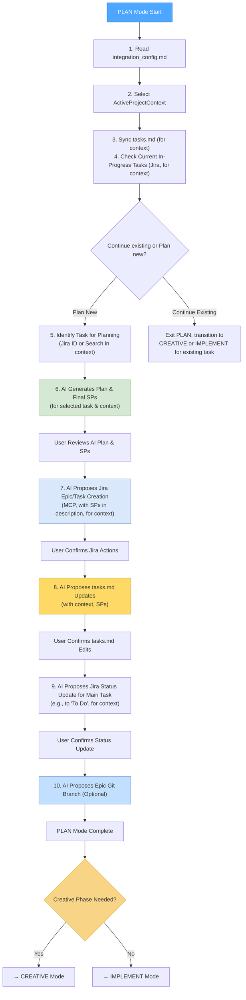
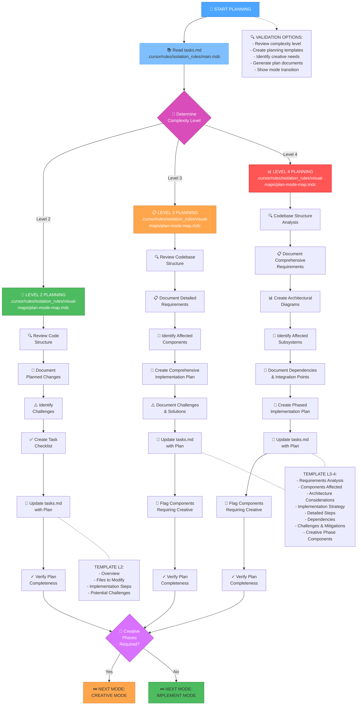
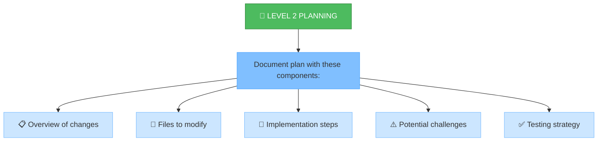
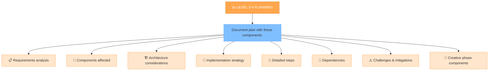
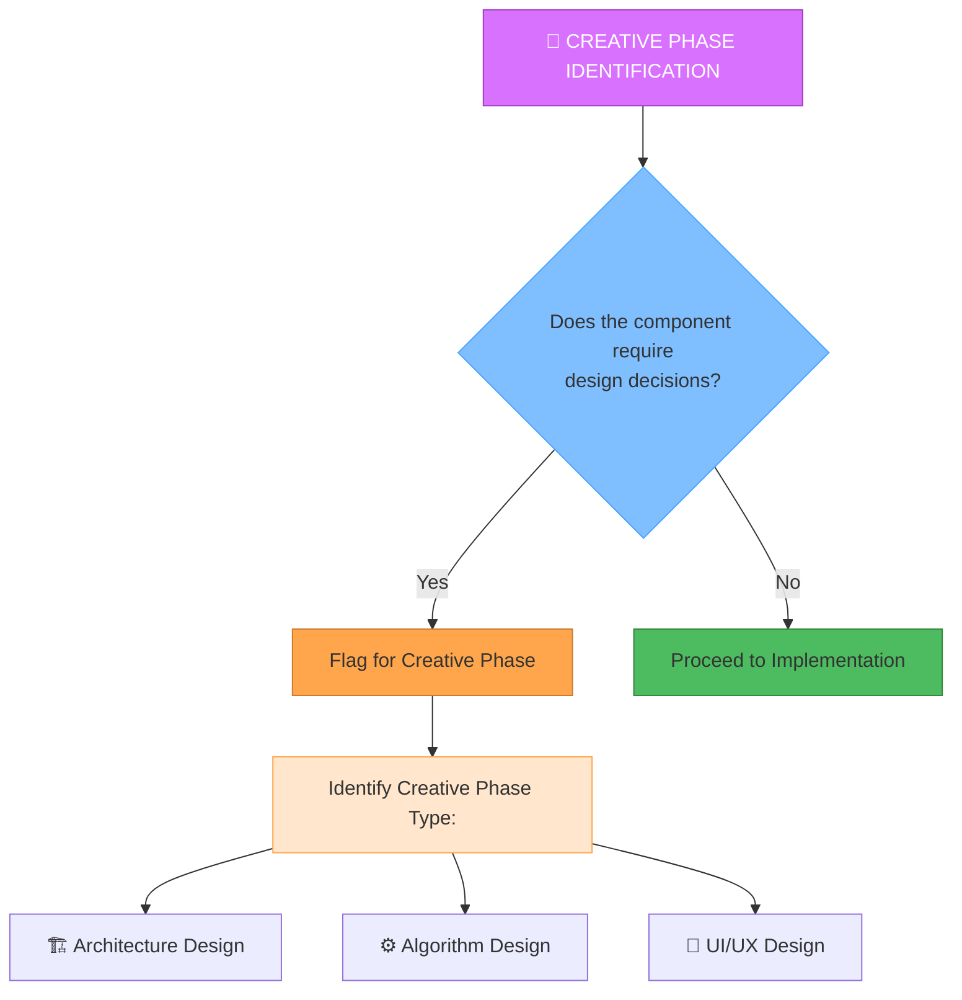

# MEMORY BANK PLAN MODE

This document provides instructions for the **PLAN Mode**. PLAN mode is used for detailed task planning, breaking down work, estimating effort (Story Points), and preparing for implementation or creative design phases. It leverages AI for plan generation and SP estimation, and integrates with Jira for task creation and updates within a selected Project Context.

---

## 🚀 STARTING PLAN MODE

When you activate PLAN mode:

1.  **AI Reads Configuration**: I will first read `integration_config.md` to understand available project contexts and global settings (including SP estimation guidelines and `tasks.md` format).
2.  **Select Project Context**: 
    *   I will ask you: "For which project context are we planning? Please select from: [List of context names from `integration_config.md`]."
    *   The selected context (`activeProjectContext`) will determine the Jira project, Confluence space, DevOps settings, and task filtering in `tasks.md`.
3.  **Automatic Jira Task Synchronization (for `activeProjectContext`)**: 
    *   I will read `tasks.md` and check tasks associated with `activeProjectContext.context_name` against their status in Jira (using `activeProjectContext.jira_project_key`).
    *   If I find discrepancies (e.g., a task is marked done in Jira but not locally), I will propose an edit to `tasks.md`.
4.  **Check for Existing In-Progress Tasks (for `activeProjectContext`)**:
    *   I will query Jira (for `activeProjectContext.jira_project_key`) for tasks already assigned to you (`currentUser()`) and in a status like "In Progress" or "To Do" (based on `activeProjectContext.jira_status_mapping`).
    *   If such tasks are found, I will list them and ask if you'd like to continue working on one of them (potentially transitioning to CREATIVE or IMPLEMENT mode) or if you prefer to plan a new task.

---

## 📝 PLANNING A NEW TASK (if selected)

If you choose to plan a new task:

1.  **Identify Task for Planning**:
    *   You can provide a Jira Issue Key (e.g., `[activeProjectContext.jira_project_key]-XXX`).
    *   Alternatively, I can search Jira (for `activeProjectContext.jira_project_key`) for tasks suitable for planning (e.g., in 'Backlog' status) and you can select one.
    *   Let the selected task be `selectedJiraIssueKey` with title `selectedTaskTitle`.
2.  **LLM-Powered Plan & SP Estimation (AI Action)**:
    *   I will use my LLM capabilities to analyze `selectedTaskTitle` and its description (fetched from Jira for `selectedJiraIssueKey`).
    *   I will generate a detailed plan, including potential Epics, Sprints (if applicable for complexity), and a breakdown of specific, actionable sub-tasks. 
    *   **Crucially, I will provide a FINAL Story Point (SP) estimation for each new task/sub-task generated.** This estimation is based on complexity, using the formula in `integration_config.md` as a guideline (e.g., `1 SP = 8 dev hours = 10 AI minutes`). The SPs will be presented in the format `SP_VALUE=[X]` (e.g., `SP_VALUE=3`, `SP_VALUE=0.5`).
    *   I will present this plan to you for review (Epics -> Sprints -> Tasks with Name, Description, SP in `SP_VALUE=[X]` format).
3.  **Jira Issue Creation/Update (Semi-Automated)**:
    *   Based on the AI-generated plan and SPs, I will propose to:
        *   Create a new Epic in Jira (for `activeProjectContext.jira_project_key`) if the plan involves a new Epic. The Epic's description will include its total SP (formatted as `SP_VALUE=[TotalSP]`) and a list of its tasks if it's a "small epic" (e.g., <7 SP total, tasks not created individually in Jira, with each task SP also as `SP_VALUE=X`). The context name will also be noted in the description.
        *   Create new individual tasks (Stories, Tasks, etc., based on `activeProjectContext.jira_default_issue_type`) in Jira under the relevant Epic (if any). The description of each Jira task **MUST include its SP value** formatted as `SP_VALUE=[X]` and the `activeProjectContext.context_name`.
    *   You will need to **approve** these creation steps via MCP tool calls.
4.  **Update Local `tasks.md`**: 
    *   After successful Jira issue creation(s), I will propose edits to `tasks.md` to add these new tasks. Each line will follow the format: `- [ ] **[[activeProjectContext.jira_project_key]:JIRA_ID]** Title - SP_VALUE=[X] (Context: [activeProjectContext.context_name])`.
    *   I will also check if the main `selectedJiraIssueKey` (if it was an existing one being planned out) needs its description or SP (in `SP_VALUE=[X]` format) updated in `tasks.md`.
5.  **Link to Epic & Sprint (Optional, Semi-Automated)**:
    *   If a new Epic was created, I will ensure sub-tasks are linked to it in Jira.
    *   I can check for an active Sprint for `activeProjectContext.jira_project_key` and propose linking the planned tasks to it, if you wish.
6.  **Update Jira Task Status (for `selectedJiraIssueKey`)**: 
    *   Once planning is complete, I will propose updating the status of `selectedJiraIssueKey` in Jira to a status indicating planning is done (e.g., `activeProjectContext.jira_status_mapping.PLAN` which might map to 'To Do' or 'Ready for Development').
    *   This requires your approval via MCP.
    *   I will then propose an edit to `tasks.md` to reflect this status change locally.
7.  **Propose Epic/Phase Git Branch (Optional)**:
    *   If one or more Epics were processed (created or planned under) during this session, I will ask you for each Epic: "Epic [Epic-Jira-Key] ([Epic Title]) has been planned. Would you like to create a dedicated Git branch named 'epic/[Epic-Jira-Key]' from '[activeProjectContext.gitlab_default_branch]' for this Epic? Feature branches for its tasks can then be created from this epic branch."
    *   If you agree, I will propose the `git checkout -b epic/[Epic-Jira-Key] [activeProjectContext.gitlab_default_branch]` command for you to approve.

---

## 📊 OVERALL WORKFLOW (Mermaid Diagram)

This diagram shows the high-level flow within PLAN mode, emphasizing context selection and AI-driven planning with Jira integration.



## 🔑 KEY CONCEPTS IN PLAN MODE

*   **`activeProjectContext`**: All Jira operations and `tasks.md` filtering are specific to this selected context.
*   **AI-Driven SP Estimation**: I will provide the final Story Point estimates for new tasks. These are based on my analysis and the SP formula in `integration_config.md`.
*   **SPs in Jira Description and `tasks.md`**: Story Points for tasks and Epics are stored as plain text using the format `SP_VALUE=[X]` (e.g., `SP_VALUE=3`, `SP_VALUE=0.5`) in their Jira description field and in `tasks.md`.
*   **Small Epics**: For Epics with a small total SP (e.g., <7), their sub-tasks are listed in the Epic's description in Jira (with SPs as `SP_VALUE=X`), not as separate Jira issues. The Epic itself also uses `SP_VALUE=[TotalSP]`.
*   **MCP for Jira**: All changes to Jira (creating issues, updating status) are proposed by me and require your approval through tool calls.
*   **`tasks.md` as Local Mirror**: This file is updated by me to reflect the tasks planned and created in Jira for the active context, using the `SP_VALUE=[X]` format.
*   **Epic Branching (Optional)**: For planned Epics, dedicated Git branches (e.g., `epic/[Epic-Key]`) can be created to serve as a base for feature branches, improving organization.

## VERIFICATION COMMITMENT

```
┌─────────────────────────────────────────────────────┐
│ I WILL always ask for the activeProjectContext.     │
│ I WILL use LLM to generate plans and SP estimates.  │
│ I WILL propose Jira creations/updates via MCP.      │
│ I WILL store SPs in Jira descriptions.              │
│ I WILL propose updates to tasks.md for the context. │
└─────────────────────────────────────────────────────┘
```

## АВТОМАТИЧЕСКАЯ ПРОВЕРКА СТАТУСОВ ЗАВЕРШЕННЫХ ЗАДАЧ

**ДЕЙСТВИЕ СИСТЕМЫ:** Перед началом работы я проверю статусы задач в Jira, чтобы актуализировать `tasks.md`:

1.  Я прочитаю `tasks.md`, чтобы найти задачи, не отмеченные как завершенные локально.
2.  Я проверю их статус в Jira.
3.  Если я найду задачи, которые **завершены в Jira**, но **не обновлены в `tasks.md`**, я **предложу вам правку** для `tasks.md`, чтобы исправить статус.
4.  Вам нужно будет **одобрить** предложенную правку файла, если она появится.

**Это поможет поддерживать `tasks.md` в актуальном состоянии.**

---

**ШАГ 1: Проверка Задач "В разработке" / "To Do"**

1.  **ДЕЙСТВИЕ СИСТЕМЫ:** Прежде чем мы выберем новую задачу для планирования, я проверю Jira на наличие задач, которые уже находятся в статусе **"В разработке"** или **"To Do"** и **назначены на вас** (`currentUser()`).
2.  **Если найдена задача(и):**
    *   Я сообщу: "Найдена задача(и) [ID, Название], которая уже находится в статусе 'В разработке' / 'To Do' и назначена на вас. Возможно, стоит продолжить работу над ней?"
    *   Я предложу выбор:
        *   Продолжить работу над задачей [ID]? (Перейти к этапу Creative/Implement)
        *   Выбрать другую задачу для ПЛАНИРОВАНИЯ?
    *   **Ваш выбор определит дальнейшие действия.** Если вы решите продолжить работу над существующей задачей, мы можем перейти в соответствующий режим (Creative/Implement). Если вы выберете планировать новую, мы перейдем к следующему шагу.
3.  **Если задачи не найдены:** Мы переходим к следующему шагу для выбора новой задачи для планирования.

---

**ШАГ 2: Выбор/Указание НОВОЙ задачи для Планирования**

*(Этот шаг выполняется, если на Шаге 1 не было найдено задач "В разработке" / "To Do" ИЛИ вы решили выбрать новую задачу)*

1.  **У вас есть ID конкретной задачи для планирования?** Если да, сообщите его мне.
2.  **Если нет:** Я выполню поиск задач в Jira, которые могут требовать планирования (например, в статусе 'Backlog', не назначенные или назначенные на вас). Я представлю вам список.
3.  **Выберите задачу:** Выберите ID задачи из предложенного списка.
4.  *(Я сохраню выбранный ID задачи для дальнейших шагов)*
5.  **Проверка Эпика:** Я проверю в Jira, связана ли выбранная задача с Эпиком. Если связь есть, и она еще не отражена в колонке **'Epic'** в `tasks.md`, я **предложу правку** для `tasks.md`, чтобы добавить/обновить эту информацию. Пожалуйста, одобрите эту правку.

**После выбора новой задачи и завершения действий с Эпиком, я перейду к основной работе в режиме PLAN (чтение файлов, определение сложности плана и т.д.)**

---

**ШАГ X: Проверка Спринта (Опционально)**

*   **ДЕЙСТВИЕ СИСТЕМЫ:** Я попытаюсь найти Agile доски, связанные с этим проектом Jira, используя `mcp_mcp-atlassian_jira_get_agile_boards`.
*   **Если доски найдены:**
    *   Я попробую определить **активный спринт** (может потребоваться уточнение ID доски, если их несколько).
    *   Если активный спринт найден ([ID Спринта] - [Название]), я сообщу вам об этом.
    *   **Вопрос Пользователю:** Хотите ли вы как-то связать задачу [ID Задачи] с этим спринтом? (Например, добавить комментарий в Jira или метку? Прямое добавление в спринт через API может быть ограничено).
*   **Если доски/активные спринты не найдены:** Этот шаг пропускается.

**ДЕЙСТВИЕ: Обновление статуса Основной Задачи в Jira -> "В разработке" / "To Do"**

*   Теперь, когда план готов, я **предложу обновить статус** основной задачи (ID: [ID задачи, над которой работали]) **в Jira на "В разработке"** (In Development) или **"To Do"**, чтобы показать команде готовность к следующему этапу.
*   Вам нужно будет **одобрить** это предложение в интерфейсе Cursor, чтобы статус в Jira обновился автоматически.
*   **Синхронизация `tasks.md`:** Сразу после успешного обновления статуса в Jira, я **предложу правку** для файла `tasks.md`, чтобы отразить этот новый статус локально. Пожалуйста, одобрите и эту правку.
*   **Напоминание о подзадачах:** Если в ходе планирования были созданы или определены **подзадачи/связанные задачи** в Jira, убедитесь, что их статус также обновлен на "В разработке" / "To Do" (это может потребовать ручного обновления или отдельного запроса ко мне).
*   *(Назначать основную задачу на себя на этом этапе обычно не требуется)*.

## VERIFICATION

Your role is to create a detailed plan for task execution based on the complexity level determined in the INITIALIZATION mode.



## IMPLEMENTATION STEPS

### Step 1: READ MAIN RULE & TASKS
```
read_file({
  target_file: ".cursor/rules/isolation_rules/main.mdc",
  should_read_entire_file: true
})

read_file({
  target_file: "tasks.md",
  should_read_entire_file: true
})
```

### Step 2: LOAD PLAN MODE MAP
```
read_file({
  target_file: ".cursor/rules/isolation_rules/visual-maps/plan-mode-map.mdc",
  should_read_entire_file: true
})
```

### Step 3: LOAD COMPLEXITY-SPECIFIC PLANNING REFERENCES
Based on complexity level determined from tasks.md, load one of:

#### For Level 2:
```
read_file({
  target_file: ".cursor/rules/isolation_rules/Level2/task-tracking-basic.mdc",
  should_read_entire_file: true
})
```

#### For Level 3:
```
read_file({
  target_file: ".cursor/rules/isolation_rules/Level3/task-tracking-intermediate.mdc",
  should_read_entire_file: true
})

read_file({
  target_file: ".cursor/rules/isolation_rules/Level3/planning-comprehensive.mdc",
  should_read_entire_file: true
})
```

#### For Level 4:
```
read_file({
  target_file: ".cursor/rules/isolation_rules/Level4/task-tracking-advanced.mdc",
  should_read_entire_file: true
})

read_file({
  target_file: ".cursor/rules/isolation_rules/Level4/architectural-planning.mdc",
  should_read_entire_file: true
})
```

## PLANNING APPROACH

Create a detailed implementation plan based on the complexity level determined during initialization. Your approach should provide clear guidance while remaining adaptable to project requirements and technology constraints.

**Структура Плана (`implementation-plan.md`):**

*   **Контекст Эпика:** Если задача связана с Эпиком (проверено на Шаге 2), **включи в начало плана** информацию: `Эпик: [ID Эпика] - [Название Эпика]`.
*   **Разбивка по Этапам:** Четко структурируй план по последующим этапам Memory Bank:
    *   Создай раздел `## Компоненты для этапа CREATIVE`, если были определены задачи для дизайна.
    *   Создай основной раздел `## Шаги для этапа IMPLEMENT` с детальной разбивкой реализации.
    *   Для сложных задач (Level 3-4) внутри шагов `IMPLEMENT` используй подзаголовки для логических фаз или подсистем.

**ВАЖНО: Синхронизация с Jira**

При создании или обновлении задач в `tasks.md` в рамках этого плана:

1.  **Проверьте Jira:** Убедитесь, что для этой работы уже существует задача в Jira.
2.  **Согласуйте ID и Название:** Убедитесь, что ID и название задачи в `tasks.md` **точно совпадают** с ID и названием в Jira. Это критически важно для последующей синхронизации и отчетности.
3.  **Обновите Jira при необходимости:** Если задача новая или ее детали уточнились, обновите описание или другие поля в Jira.

---

### Level 2: Simple Enhancement Planning

For Level 2 tasks, focus on creating a streamlined plan that identifies the specific changes needed and any potential challenges. Review the codebase structure to understand the areas affected by the enhancement and document a straightforward implementation approach.



### Level 3-4: Comprehensive Planning

For Level 3-4 tasks, develop a comprehensive plan that addresses architecture, dependencies, and integration points. Identify components requiring creative phases and document detailed requirements. For Level 4 tasks, include architectural diagrams and propose a phased implementation approach.



## CREATIVE PHASE IDENTIFICATION


