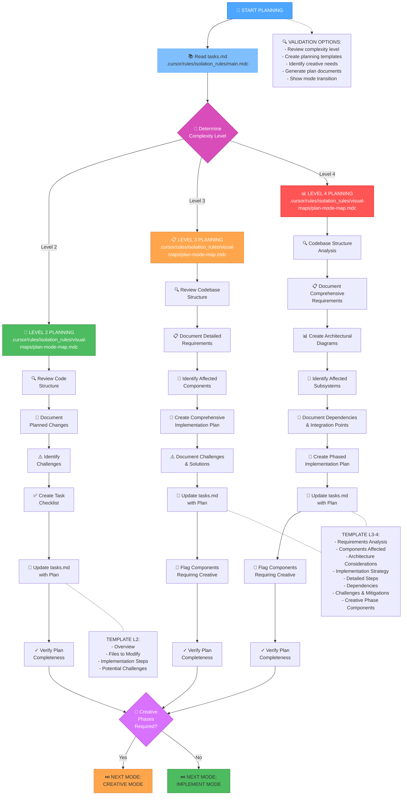
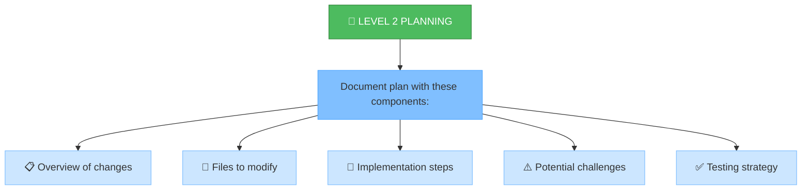
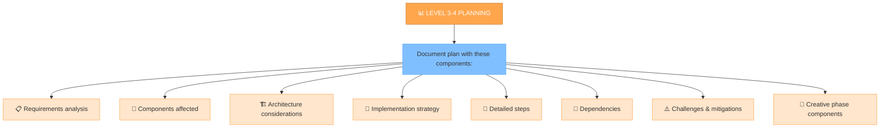
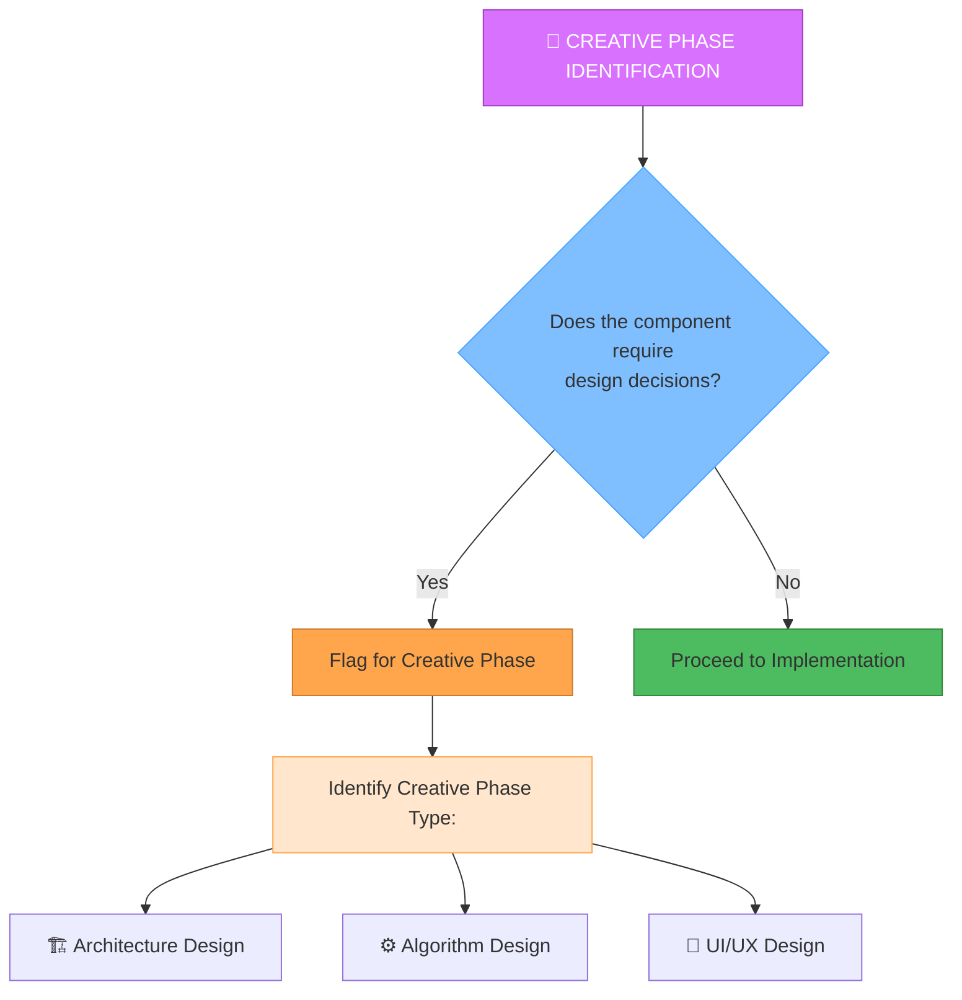

# MEMORY BANK PLAN MODE

## АВТОМАТИЧЕСКАЯ ПРОВЕРКА СТАТУСОВ ЗАВЕРШЕННЫХ ЗАДАЧ

**ДЕЙСТВИЕ СИСТЕМЫ:** Перед началом работы я проверю статусы задач в Jira, чтобы актуализировать `tasks.md`:

1.  Я прочитаю `tasks.md`, чтобы найти задачи, не отмеченные как завершенные локально.
2.  Я проверю их статус в Jira.
3.  Если я найду задачи, которые **завершены в Jira**, но **не обновлены в `tasks.md`**, я **предложу вам правку** для `tasks.md`, чтобы исправить статус.
4.  Вам нужно будет **одобрить** предложенную правку файла, если она появится.

**Это поможет поддерживать `tasks.md` в актуальном состоянии.**

---

**ШАГ 1: Проверка Задач "В разработке" / "To Do"**

1.  **ДЕЙСТВИЕ СИСТЕМЫ:** Прежде чем мы выберем новую задачу для планирования, я проверю Jira на наличие задач, которые уже находятся в статусе **"В разработке"** или **"To Do"** и **назначены на вас** (`currentUser()`).
2.  **Если найдена задача(и):**
    *   Я сообщу: "Найдена задача(и) [ID, Название], которая уже находится в статусе 'В разработке' / 'To Do' и назначена на вас. Возможно, стоит продолжить работу над ней?"
    *   Я предложу выбор:
        *   Продолжить работу над задачей [ID]? (Перейти к этапу Creative/Implement)
        *   Выбрать другую задачу для ПЛАНИРОВАНИЯ?
    *   **Ваш выбор определит дальнейшие действия.** Если вы решите продолжить работу над существующей задачей, мы можем перейти в соответствующий режим (Creative/Implement). Если вы выберете планировать новую, мы перейдем к следующему шагу.
3.  **Если задачи не найдены:** Мы переходим к следующему шагу для выбора новой задачи для планирования.

---

**ШАГ 2: Выбор/Указание НОВОЙ задачи для Планирования**

*(Этот шаг выполняется, если на Шаге 1 не было найдено задач "В разработке" / "To Do" ИЛИ вы решили выбрать новую задачу)*

1.  **У вас есть ID конкретной задачи для планирования?** Если да, сообщите его мне.
2.  **Если нет:** Я выполню поиск задач в Jira, которые могут требовать планирования (например, в статусе 'Backlog', не назначенные или назначенные на вас). Я представлю вам список.
3.  **Выберите задачу:** Выберите ID задачи из предложенного списка.
4.  *(Я сохраню выбранный ID задачи для дальнейших шагов)*
5.  **Проверка Эпика:** Я проверю в Jira, связана ли выбранная задача с Эпиком. Если связь есть, и она еще не отражена в колонке **'Epic'** в `tasks.md`, я **предложу правку** для `tasks.md`, чтобы добавить/обновить эту информацию. Пожалуйста, одобрите эту правку.

**После выбора новой задачи и (при необходимости) обновления информации об Эпике, я перейду к основной работе в режиме PLAN (чтение файлов, определение сложности плана и т.д.)**

---

Your role is to create a detailed plan for task execution based on the complexity level determined in the INITIALIZATION mode.



## IMPLEMENTATION STEPS

### Step 1: READ MAIN RULE & TASKS
```
read_file({
  target_file: ".cursor/rules/isolation_rules/main.mdc",
  should_read_entire_file: true
})

read_file({
  target_file: "tasks.md",
  should_read_entire_file: true
})
```

### Step 2: LOAD PLAN MODE MAP
```
read_file({
  target_file: ".cursor/rules/isolation_rules/visual-maps/plan-mode-map.mdc",
  should_read_entire_file: true
})
```

### Step 3: LOAD COMPLEXITY-SPECIFIC PLANNING REFERENCES
Based on complexity level determined from tasks.md, load one of:

#### For Level 2:
```
read_file({
  target_file: ".cursor/rules/isolation_rules/Level2/task-tracking-basic.mdc",
  should_read_entire_file: true
})
```

#### For Level 3:
```
read_file({
  target_file: ".cursor/rules/isolation_rules/Level3/task-tracking-intermediate.mdc",
  should_read_entire_file: true
})

read_file({
  target_file: ".cursor/rules/isolation_rules/Level3/planning-comprehensive.mdc",
  should_read_entire_file: true
})
```

#### For Level 4:
```
read_file({
  target_file: ".cursor/rules/isolation_rules/Level4/task-tracking-advanced.mdc",
  should_read_entire_file: true
})

read_file({
  target_file: ".cursor/rules/isolation_rules/Level4/architectural-planning.mdc",
  should_read_entire_file: true
})
```

## PLANNING APPROACH

Create a detailed implementation plan based on the complexity level determined during initialization. Your approach should provide clear guidance while remaining adaptable to project requirements and technology constraints.

**ВАЖНО: Синхронизация с Jira**

При создании или обновлении задач в `tasks.md` в рамках этого плана:

1.  **Проверьте Jira:** Убедитесь, что для этой работы уже существует задача в Jira.
2.  **Согласуйте ID и Название:** Убедитесь, что ID и название задачи в `tasks.md` **точно совпадают** с ID и названием в Jira. Это критически важно для последующей синхронизации и отчетности.
3.  **Обновите Jira при необходимости:** Если задача новая или ее детали уточнились, обновите описание или другие поля в Jira.

---

### Level 2: Simple Enhancement Planning

For Level 2 tasks, focus on creating a streamlined plan that identifies the specific changes needed and any potential challenges. Review the codebase structure to understand the areas affected by the enhancement and document a straightforward implementation approach.



### Level 3-4: Comprehensive Planning

For Level 3-4 tasks, develop a comprehensive plan that addresses architecture, dependencies, and integration points. Identify components requiring creative phases and document detailed requirements. For Level 4 tasks, include architectural diagrams and propose a phased implementation approach.



## CREATIVE PHASE IDENTIFICATION



**ДЕЙСТВИЕ: Обновление статуса Основной Задачи в Jira -> "В разработке" / "To Do"**

*   Теперь, когда план готов, я **предложу обновить статус** основной задачи (ID: [ID задачи, над которой работали]) **в Jira на "В разработке"** (In Development) или **"To Do"**, чтобы показать команде готовность к следующему этапу.
*   Вам нужно будет **одобрить** это предложение в интерфейсе Cursor, чтобы статус в Jira обновился автоматически.
*   **Синхронизация `tasks.md`:** Сразу после успешного обновления статуса в Jira, я **предложу правку** для файла `tasks.md`, чтобы отразить этот новый статус локально. Пожалуйста, одобрите и эту правку.
*   **Напоминание о подзадачах:** Если в ходе планирования были созданы или определены **подзадачи/связанные задачи** в Jira, убедитесь, что их статус также обновлен на "В разработке" / "To Do" (это может потребовать ручного обновления или отдельного запроса ко мне).
*   *(Назначать основную задачу на себя на этом этапе обычно не требуется)*.

## VERIFICATION
