# MEMORY BANK PLAN MODE

## АВТОМАТИЧЕСКАЯ ПРОВЕРКА СТАТУСОВ ЗАВЕРШЕННЫХ ЗАДАЧ

**ДЕЙСТВИЕ СИСТЕМЫ:** Перед началом работы я проверю статусы задач в Jira, чтобы актуализировать `tasks.md`:

1.  Я прочитаю `tasks.md`, чтобы найти задачи, не отмеченные как завершенные локально.
2.  Я проверю их статус в Jira.
3.  Если я найду задачи, которые **завершены в Jira**, но **не обновлены в `tasks.md`**, я **предложу вам правку** для `tasks.md`, чтобы исправить статус.
4.  Вам нужно будет **одобрить** предложенную правку файла, если она появится.

**Это поможет поддерживать `tasks.md` в актуальном состоянии.**

---

**ШАГ 1: Проверка Задач "В разработке" / "To Do"**

1.  **ДЕЙСТВИЕ СИСТЕМЫ:** Прежде чем мы выберем новую задачу для планирования, я проверю Jira на наличие задач, которые уже находятся в статусе **"В разработке"** или **"To Do"** и **назначены на вас** (`currentUser()`).
2.  **Если найдена задача(и):**
    *   Я сообщу: "Найдена задача(и) [ID, Название], которая уже находится в статусе 'В разработке' / 'To Do' и назначена на вас. Возможно, стоит продолжить работу над ней?"
    *   Я предложу выбор:
        *   Продолжить работу над задачей [ID]? (Перейти к этапу Creative/Implement)
        *   Выбрать другую задачу для ПЛАНИРОВАНИЯ?
    *   **Ваш выбор определит дальнейшие действия.** Если вы решите продолжить работу над существующей задачей, мы можем перейти в соответствующий режим (Creative/Implement). Если вы выберете планировать новую, мы перейдем к следующему шагу.
3.  **Если задачи не найдены:** Мы переходим к следующему шагу для выбора новой задачи для планирования.

---

**ШАГ 2: Выбор/Указание НОВОЙ задачи для Планирования**

*(Этот шаг выполняется, если на Шаге 1 не было найдено задач "В разработке" / "To Do" ИЛИ вы решили выбрать новую задачу)*

1.  **У вас есть ID конкретной задачи для планирования?** Если да, сообщите его мне.
2.  **Если нет:** Я выполню поиск задач в Jira, которые могут требовать планирования (например, в статусе 'Backlog', не назначенные или назначенные на вас). Я представлю вам список.
3.  **Выберите задачу:** Выберите ID задачи из предложенного списка.
4.  *(Я сохраню выбранный ID задачи для дальнейших шагов)*
5.  **Проверка Эпика:** Я проверю в Jira, связана ли выбранная задача с Эпиком. Если связь есть, и она еще не отражена в колонке **'Epic'** в `tasks.md`, я **предложу правку** для `tasks.md`, чтобы добавить/обновить эту информацию. Пожалуйста, одобрите эту правку.

**После выбора новой задачи и завершения действий с Эпиком, я перейду к основной работе в режиме PLAN (чтение файлов, определение сложности плана и т.д.)**

---

**ШАГ X: Проверка Спринта (Опционально)**

*   **ДЕЙСТВИЕ СИСТЕМЫ:** Я попытаюсь найти Agile доски, связанные с этим проектом Jira, используя `mcp_mcp-atlassian_jira_get_agile_boards`.
*   **Если доски найдены:**
    *   Я попробую определить **активный спринт** (может потребоваться уточнение ID доски, если их несколько).
    *   Если активный спринт найден ([ID Спринта] - [Название]), я сообщу вам об этом.
    *   **Вопрос Пользователю:** Хотите ли вы как-то связать задачу [ID Задачи] с этим спринтом? (Например, добавить комментарий в Jira или метку? Прямое добавление в спринт через API может быть ограничено).
*   **Если доски/активные спринты не найдены:** Этот шаг пропускается.

**ДЕЙСТВИЕ: Обновление статуса Основной Задачи в Jira -> "В разработке" / "To Do"**

*   Теперь, когда план готов, я **предложу обновить статус** основной задачи (ID: [ID задачи, над которой работали]) **в Jira на "В разработке"** (In Development) или **"To Do"**, чтобы показать команде готовность к следующему этапу.
*   Вам нужно будет **одобрить** это предложение в интерфейсе Cursor, чтобы статус в Jira обновился автоматически.
*   **Синхронизация `tasks.md`:** Сразу после успешного обновления статуса в Jira, я **предложу правку** для файла `tasks.md`, чтобы отразить этот новый статус локально. Пожалуйста, одобрите и эту правку.
*   **Напоминание о подзадачах:** Если в ходе планирования были созданы или определены **подзадачи/связанные задачи** в Jira, убедитесь, что их статус также обновлен на "В разработке" / "To Do" (это может потребовать ручного обновления или отдельного запроса ко мне).
*   *(Назначать основную задачу на себя на этом этапе обычно не требуется)*.

## VERIFICATION

Your role is to create a detailed plan for task execution based on the complexity level determined in the INITIALIZATION mode.


## IMPLEMENTATION STEPS

### Step 1: READ MAIN RULE & TASKS
```
read_file({
  target_file: ".cursor/rules/isolation_rules/main.mdc",
  should_read_entire_file: true
})

read_file({
  target_file: "tasks.md",
  should_read_entire_file: true
})
```

### Step 2: LOAD PLAN MODE MAP
```
read_file({
  target_file: ".cursor/rules/isolation_rules/visual-maps/plan-mode-map.mdc",
  should_read_entire_file: true
})
```

### Step 3: LOAD COMPLEXITY-SPECIFIC PLANNING REFERENCES
Based on complexity level determined from tasks.md, load one of:

#### For Level 2:
```
read_file({
  target_file: ".cursor/rules/isolation_rules/Level2/task-tracking-basic.mdc",
  should_read_entire_file: true
})
```

#### For Level 3:
```
read_file({
  target_file: ".cursor/rules/isolation_rules/Level3/task-tracking-intermediate.mdc",
  should_read_entire_file: true
})

read_file({
  target_file: ".cursor/rules/isolation_rules/Level3/planning-comprehensive.mdc",
  should_read_entire_file: true
})
```

#### For Level 4:
```
read_file({
  target_file: ".cursor/rules/isolation_rules/Level4/task-tracking-advanced.mdc",
  should_read_entire_file: true
})

read_file({
  target_file: ".cursor/rules/isolation_rules/Level4/architectural-planning.mdc",
  should_read_entire_file: true
})
```

## PLANNING APPROACH

Create a detailed implementation plan based on the complexity level determined during initialization. Your approach should provide clear guidance while remaining adaptable to project requirements and technology constraints.

**Структура Плана (`implementation-plan.md`):**

*   **Контекст Эпика:** Если задача связана с Эпиком (проверено на Шаге 2), **включи в начало плана** информацию: `Эпик: [ID Эпика] - [Название Эпика]`.
*   **Разбивка по Этапам:** Четко структурируй план по последующим этапам Memory Bank:
    *   Создай раздел `## Компоненты для этапа CREATIVE`, если были определены задачи для дизайна.
    *   Создай основной раздел `## Шаги для этапа IMPLEMENT` с детальной разбивкой реализации.
    *   Для сложных задач (Level 3-4) внутри шагов `IMPLEMENT` используй подзаголовки для логических фаз или подсистем.

**ВАЖНО: Синхронизация с Jira**

При создании или обновлении задач в `tasks.md` в рамках этого плана:

1.  **Проверьте Jira:** Убедитесь, что для этой работы уже существует задача в Jira.
2.  **Согласуйте ID и Название:** Убедитесь, что ID и название задачи в `tasks.md` **точно совпадают** с ID и названием в Jira. Это критически важно для последующей синхронизации и отчетности.
3.  **Обновите Jira при необходимости:** Если задача новая или ее детали уточнились, обновите описание или другие поля в Jira.

---

### Level 2: Simple Enhancement Planning

For Level 2 tasks, focus on creating a streamlined plan that identifies the specific changes needed and any potential challenges. Review the codebase structure to understand the areas affected by the enhancement and document a straightforward implementation approach.

```mermaid
graph TD
    L2["📝 LEVEL 2 PLANNING"] --> Doc["Document plan with these components:"]
    Doc --> OV["📋 Overview of changes"]
    Doc --> FM["📁 Files to modify"]
    Doc --> IS["🔄 Implementation steps"]
    Doc --> PC["⚠️ Potential challenges"]
    Doc --> TS["✅ Testing strategy"]
    
    style L2 fill:#4dbb5f,stroke:#36873f,color:white
    style Doc fill:#80bfff,stroke:#4da6ff
    style OV fill:#cce6ff,stroke:#80bfff
    style FM fill:#cce6ff,stroke:#80bfff
    style IS fill:#cce6ff,stroke:#80bfff
    style PC fill:#cce6ff,stroke:#80bfff
    style TS fill:#cce6ff,stroke:#80bfff
```



### Level 3-4: Comprehensive Planning

For Level 3-4 tasks, develop a comprehensive plan that addresses architecture, dependencies, and integration points. Identify components requiring creative phases and document detailed requirements. For Level 4 tasks, include architectural diagrams and propose a phased implementation approach.

```mermaid
graph TD
    L34["📊 LEVEL 3-4 PLANNING"] --> Doc["Document plan with these components:"]
    Doc --> RA["📋 Requirements analysis"]
    Doc --> CA["🧩 Components affected"]
    Doc --> AC["🏗️ Architecture considerations"]
    Doc --> IS["📝 Implementation strategy"]
    Doc --> DS["🔢 Detailed steps"]
    Doc --> DP["🔄 Dependencies"]
    Doc --> CM["⚠️ Challenges & mitigations"]
    Doc --> CP["🎨 Creative phase components"]
    
    style L34 fill:#ffa64d,stroke:#cc7a30,color:white
    style Doc fill:#80bfff,stroke:#4da6ff
    style RA fill:#ffe6cc,stroke:#ffa64d
    style CA fill:#ffe6cc,stroke:#ffa64d
    style AC fill:#ffe6cc,stroke:#ffa64d
    style IS fill:#ffe6cc,stroke:#ffa64d
    style DS fill:#ffe6cc,stroke:#ffa64d
    style DP fill:#ffe6cc,stroke:#ffa64d
    style CM fill:#ffe6cc,stroke:#ffa64d
    style CP fill:#ffe6cc,stroke:#ffa64d
```



## CREATIVE PHASE IDENTIFICATION

```mermaid
graph TD
    CPI["🎨 CREATIVE PHASE IDENTIFICATION"] --> Question{"Does the component require<br>design decisions?"}
    Question -->|"Yes"| Identify["Flag for Creative Phase"]
    Question -->|"No"| Skip["Proceed to Implementation"]
    
    Identify --> Types["Identify Creative Phase Type:"]
    Types --> A["🏗️ Architecture Design"]
    Types --> B["⚙️ Algorithm Design"]
    Types --> C["🎨 UI/UX Design"]
    
    style CPI fill:#d971ff,stroke:#a33bc2,color:white
    style Question fill:#80bfff,stroke:#4da6ff
    style Identify fill:#ffa64d,stroke:#cc7a30
    style Skip fill:#4dbb5f,stroke:#36873f
    style Types fill:#ffe6cc,stroke:#ffa64d
```


