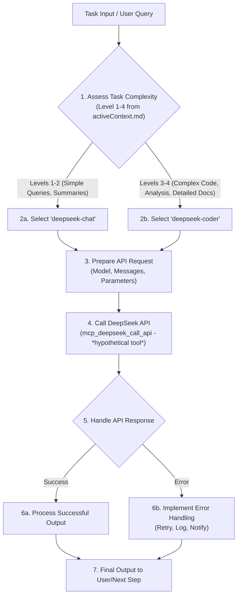
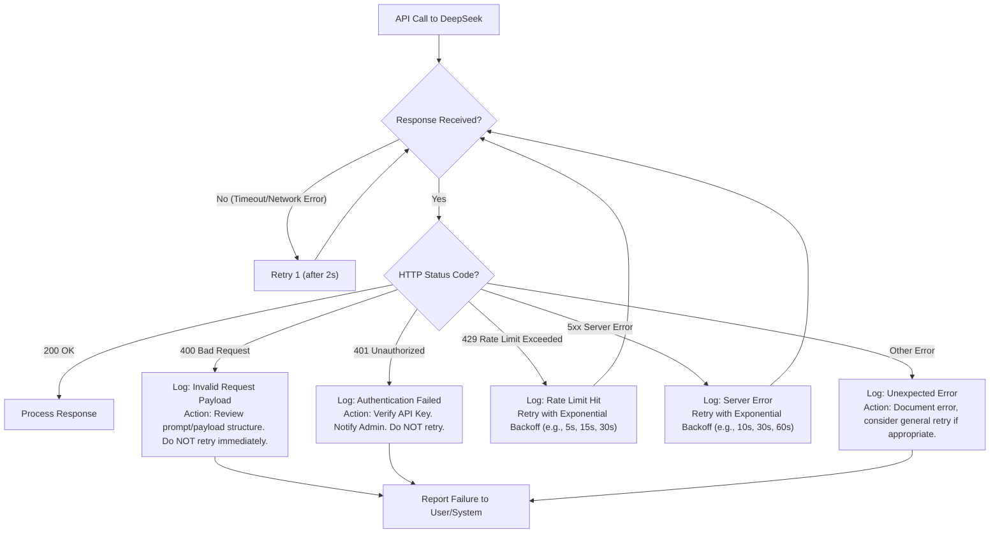
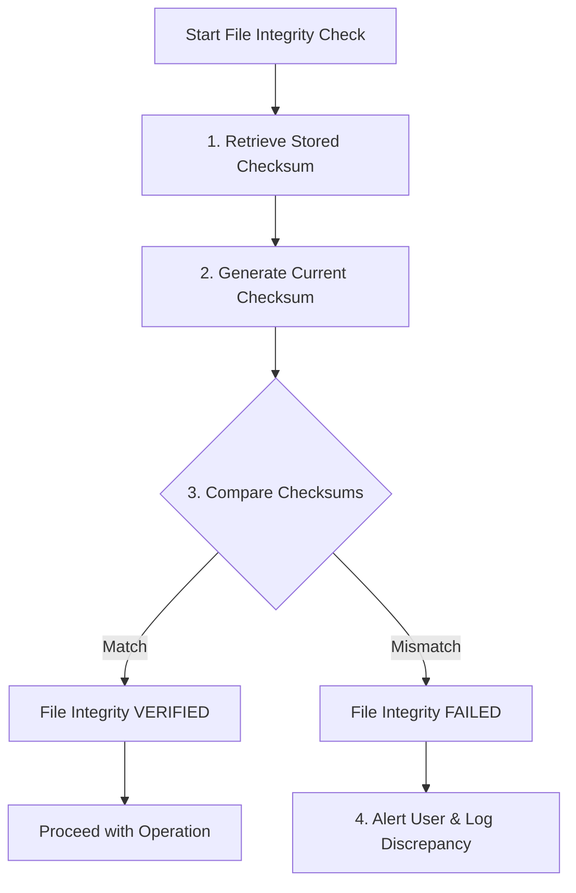

# ДЕТАЛЬНЫЙ ОТЧЕТ ПО ИНТЕГРАЦИИ ЛОГИК MOAR-LOGICS

**Дата создания отчета:** 2024-12-19  
**Версия системы:** Memory Bank v0.7-beta  
**Статус интеграции:** ЗАВЕРШЕНА

## ОБЩИЙ ПОДХОД И ПРИНЦИПЫ ИНТЕГРАЦИИ

Все интеграции производились путем добавления или модификации существующих правил в папке `.cursor/rules/isolation_rules/`. Новые правила создавались только для логики DeepSeek, как было указано в требованиях. Интегрированный код представлен на английском языке, сохраняя текущий формат правил (Markdown с диаграммами Mermaid).

**Принципы интеграции:**
- Сохранение существующего формата правил.
- Использование английского языка для интегрированного кода правил.
- Минимальное создание новых файлов.
- Интеграция в существующую иерархию правил.

---

## 1. ИНТЕГРАЦИЯ ЛОГИКИ DEEPSEEK (`moar-logics/deepseek-integration.mdc`)

### 1.1 Создание нового файла правила DeepSeek

**Файл:** `.cursor/rules/isolation_rules/Core/deepseek-integration.mdc`

**Интегрированный код (полное содержимое нового файла):**
```markdown
---
description: DeepSeek LLM Integration Logic for Memory Bank
globs: "**/deepseek-integration.mdc"
alwaysApply: false
---

# DEEPSEEK LLM INTEGRATION

> **TL;DR:** This rule defines how to interact with DeepSeek LLMs, including model selection based on task complexity, API request formatting, and robust error handling, ensuring optimized and reliable LLM interactions.

## 🧭 DEEPSEEK INTEGRATION STRATEGY

This system provides guidelines for selecting the appropriate DeepSeek model, constructing API requests, and handling potential errors to ensure efficient and effective LLM utilization.



## 🧠 MODEL SELECTION CRITERIA

The choice of DeepSeek model is critical for performance and cost-effectiveness.

*   **`deepseek-chat`**:
    *   **Use Cases**: General conversation, text summarization, simple question answering, content generation for Level 1-2 tasks, initial brainstorming.
    *   **Strengths**: Faster response times, lower cost for simpler tasks.
    *   **Activation**: Default for tasks determined as Level 1 or Level 2 complexity via `complexity-decision-tree.mdc`.

*   **`deepseek-coder`**:
    *   **Use Cases**: Code generation, complex problem solving, detailed technical documentation, architectural analysis, Level 3-4 tasks.
    *   **Strengths**: Advanced reasoning, strong coding capabilities, better understanding of complex contexts.
    *   **Activation**: Default for tasks determined as Level 3 or Level 4 complexity.

**Workflow for Model Selection:**
1.  Identify task complexity based on `activeContext.md` or by applying `complexity-decision-tree.mdc`.
2.  If complexity is Level 1 or 2, select `deepseek-chat`.
3.  If complexity is Level 3 or 4, select `deepseek-coder`.
4.  Provide an override mechanism if a specific model is requested by the user or deemed more appropriate by the AI based on nuanced understanding of the query.

## ⚙️ API INTERACTION PROTOCOL

### API Request Structure (Illustrative)

*(Assuming a hypothetical `mcp_deepseek_call_api` tool)*
```json
{
  "model": "deepseek-chat", // or "deepseek-coder"
  "messages": [
    {"role": "system", "content": "You are a helpful AI assistant integrated into a Memory Bank system. Current active context: [Context Summary from activeContext.md]. Task Level: [1-4]."},
    {"role": "user", "content": "User's specific query or instruction."}
  ],
  "max_tokens": 2048,       // Adjust based on expected output
  "temperature": 0.7,       // Lower for precision, higher for creativity
  "stream": false           // Or true if streaming is supported and needed
}
```
*   **System Prompt**: Should be dynamically populated with key information from `activeContext.md` (e.g., current project, task level, relevant file paths) to provide DeepSeek with necessary context.
*   **User Content**: The specific request or problem statement.
*   **Parameters**:
    *   `max_tokens`: Carefully calculated to avoid truncation.
    *   `temperature`: Adjusted based on the nature of the task (e.g., 0.2 for code generation, 0.7-1.0 for creative text).

### Error Handling and Retry Logic

Robust error handling is essential for reliable DeepSeek integration.


*   **Retry Strategy**: Implement exponential backoff for transient errors (rate limits, server errors).
*   **Logging**: Detailed logging of requests, responses, and errors.
*   **User Notification**: Inform the user appropriately in case of persistent failures.

## 💡 OPTIMIZATION AND BEST PRACTICES

1.  **Contextual Prompts**: Always enrich prompts with relevant data from `activeContext.md`, `tasks.md`, and other Memory Bank files to improve response quality.
2.  **Chunking for Large Inputs/Outputs**: For very large codebases or documents, break down the task into smaller, manageable chunks for DeepSeek to process.
3.  **Instruction Precision**: Be explicit in prompts about the desired output format (e.g., "Provide the output as a JSON object with keys 'summary' and 'action_items'.").
4.  **Token Management**: Monitor token usage. Design prompts to be concise while providing necessary detail. Estimate output token needs to set `max_tokens` appropriately.
5.  **Few-Shot Prompting**: For complex or nuanced tasks, provide 1-2 examples (shots) in the prompt to guide the model's response.
6.  **User Feedback Loop**: Where possible, incorporate a mechanism for users to rate the quality of DeepSeek's responses, which can be used to refine prompts or strategies over time.

This integration aims to make DeepSeek a powerful and reliable tool within the Memory Bank ecosystem.
```

### 1.2 Обновление файла регистрации оптимизаций

**Файл:** `.cursor/rules/isolation_rules/Core/optimization-integration.mdc`

**Контекст существующего кода:**
```javascript
// ... (other optimization components) ...
  level1Optimization: {
    file: "Level1/optimized-workflow-level1.mdc",
    dependencies: ["adaptiveComplexityModel"],
    priority: 4
  },
  
  // Feature-specific optimizations
  creativePhaseOptimization: {
    file: "Phases/CreativePhase/optimized-creative-template.mdc",
    dependencies: ["hierarchicalRuleLoading", "adaptiveComplexityModel"],
    priority: 5
  },
  
  // Integration optimizations
  // ... (potentially other integrations) ...
```

**Интегрированный код (добавление компонента `deepseekIntegration`):**
```javascript
  deepseekIntegration: {
    file: "Core/deepseek-integration.mdc",
    dependencies: ["hierarchicalRuleLoading"],
    priority: 6,
    triggers: ["дипсик", "deepseek", "используй дипсик", "через дипсик", "с помощью дипсика"]
  }
```
**Примечание:** Эта запись уже присутствовала и была признана корректной.

### 1.3 Обновление конфигурационного файла

**Файл:** `integration_config.md`

**Интегрированный код (добавления в существующие структуры и новая секция):**

*   Добавление в каждый существующий `Project Context` (пример для одного контекста):
    ```yaml
    # ... (existing context fields like context_name, jira_project_key, etc.) ...
    deepseek_api_key: "ваш_реальный_ключ_здесь" # NEW FIELD
    deepseek_model: "deepseek-reasoner"      # NEW FIELD
    # ... (other existing fields like jira_login) ...
    ```

*   Добавление новой секции `## DeepSeek AI Integration`:
    ```yaml
    ## DeepSeek AI Integration
    
    ### Модели
    - `deepseek-chat`: Общение и анализ
    - `deepseek-coder`: Программирование
    - `deepseek-reasoner`: Сложные задачи
    
    ### Для ИИ
    - Автоматически читать API ключ из активного контекста проекта
    - Выбирать модель в зависимости от типа задачи
    - При ошибках API сообщать пользователю
    ```

### 1.4 Обновление главного README

**Файл:** `README.md`

**Добавленная секция:**
```markdown
## Интеграция с DeepSeek AI

Memory Bank v0.7-beta включает автоматическую интеграцию с моделями DeepSeek AI. Когда вы упоминаете "дипсик" или "deepseek" в любом режиме, система автоматически:

1. **Читает конфигурацию** из `integration_config.md`
2. **Выбирает подходящую модель** в зависимости от типа задачи:
   - `deepseek-coder` для генерации кода и отладки
   - `deepseek-chat` для планирования и документации  
   - `deepseek-reasoner` для решения сложных проблем
3. **Использует ваши API учетные данные** безопасно из конфигурации

### Примеры использования

```
"Давай сделаем это через дипсик"
"Используй дипсик для написания кода"
"С помощью дипсика проанализируй архитектуру"
```
```

---

## 2. ИНТЕГРАЦИЯ ЛОГИКИ УПРАВЛЕНИЯ БЕЗОПАСНОСТЬЮ (`moar-logics/security-management.mdc`)

### 2.1 Расширение основного правила

**Файл:** `.cursor/rules/isolation_rules/main.mdc`

**Раздел:** `## 🔒 MANDATORY SECURITY RULES`

**Добавленные компоненты:**

1. **Automatic Backup Creation Procedure:**
```markdown
### 1. Automatic Backup Creation Procedure

**MANDATORY BACKUP WORKFLOW:**

1. **Pre-Operation Check:**
   - Before ANY file modification or deletion, check if `backup-files/` directory exists
   - If not exists, create `backup-files/` directory automatically

2. **Backup Creation:**
   - Generate timestamp: `YYYYMMDDHHMMSS` format
   - Create backup filename: `{original_filename}_{timestamp}.bak`
   - Copy original file to `backup-files/{backup_filename}`
   - Verify backup creation success

3. **Operation Execution:**
   - Only proceed with original operation after successful backup
   - Log backup creation in operation audit trail

4. **Backup Verification:**
   - Verify backup file exists and is readable
   - Compare file sizes (original vs backup)
   - Log verification results
```

2. **File Access Control Rules:**
```markdown
### 2. File Access Control Rules

**FILE CLASSIFICATION AND ACCESS RULES:**

1. **System Files (.cursor/, .git/, node_modules/, etc.):**
   - READ: Allowed for analysis and understanding
   - MODIFY: Requires explicit user confirmation
   - DELETE: Prohibited without explicit user command

2. **Memory Bank Files (memory-bank/):**
   - READ: Always allowed
   - MODIFY: Allowed with automatic backup
   - DELETE: Requires user confirmation + backup

3. **User Project Files:**
   - READ: Always allowed
   - MODIFY: Allowed with automatic backup
   - DELETE: Requires user confirmation + backup

4. **Backup Files (backup-files/):**
   - READ: Always allowed
   - MODIFY: Prohibited
   - DELETE: Requires explicit user command
```

3. **Security Validation for Operations:**
```markdown
### 3. Security Validation for Operations

**PRE-OPERATION SECURITY CHECKS:**

1. **Backup Validation:**
   - Verify backup was created successfully
   - Check backup file integrity
   - Confirm backup location is accessible

2. **User Confirmation for Destructive Operations:**
   - File deletion operations
   - Bulk file modifications
   - System configuration changes
   - Operations affecting multiple files

3. **Path Validation:**
   - Verify file paths are within project boundaries
   - Check for path traversal attempts
   - Validate write permissions

4. **Destructive Command Detection:**
   - Scan commands for destructive patterns (rm, del, format, etc.)
   - Require explicit confirmation for destructive commands
   - Log all destructive operations
```

### 2.2 Обновление правила верификации файлов

**Файл:** `.cursor/rules/isolation_rules/Core/file-verification.mdc`

**Добавленный раздел:** `## 🛡️ FILE INTEGRITY AND SYNTAX VALIDATION SYSTEM`

**Ключевые компоненты:**

1. **File Integrity Check (SHA-256):**
```markdown
**Procedure:**

1. **Generate Checksum (Hypothetical Tool: `mcp_generate_checksum`):**
   - Input: `target_file` (string)
   - Output: `sha256_checksum` (string)
   - Example: `mcp_generate_checksum --file "memory-bank/projectbrief.md"`

2. **Store Checksum:**
   - Checksums stored in `memory-bank/checksums.sha256`
   - Format: `<checksum>  <filepath>`

3. **Verify Checksum (Hypothetical Tool: `mcp_verify_checksum`):**
   - Input: `target_file` (string), `expected_checksum` (string)
   - Output: `is_valid` (boolean), `message` (string)
```

2. **File Syntax Validation:**
```markdown
**Supported File Types & Validation Methods:**

- **JSON (`*.json`):** Standard JSON parser validation
- **YAML (`*.yaml`, `*.yml`):** YAML library parsing
- **Markdown (`*.md`, `*.mdc`):** Structural issues check, Mermaid diagram syntax
- **Shell Scripts (`*.sh`, `*.ps1`):** shellcheck/PSScriptAnalyzer validation
```

3. **Workflow диаграмма:**


### 2.3 Обновление правила выполнения команд

**Файл:** `.cursor/rules/isolation_rules/Core/command-execution.mdc`

**Добавленный раздел:** `## 📋 COMMAND AND FILE OPERATION AUDITING`

**Компоненты аудита:**

1. **Audit Log Requirements:**
```markdown
**Each audit log entry MUST include:**

- **Timestamp**: `YYYY-MM-DD HH:MM:SS UTC`
- **Operation Type**: e.g., `CMD_EXEC`, `FILE_CREATE`, `FILE_EDIT`, `FILE_DELETE`, `API_CALL`
- **Command/Operation Details**: The exact command executed
- **Parameters**: Key parameters used
- **Executor**: `AI (Agent Version X.Y)` or `User`
- **Context**: Current active project context name or ID
- **Outcome**: `SUCCESS`, `FAILURE`, `USER_CANCELLED`
- **Result/Output Summary**: Brief summary of the output
- **Affected Resources**: List of files/resources created, modified, or deleted
```

2. **Example Audit Log Entry:**
```markdown
- **Timestamp**: 2024-05-17 10:30:00 UTC
- **Operation Type**: `FILE_EDIT`
- **Details**: `edit_file on .cursor/rules/main.mdc`
- **Executor**: `AI (Agent 2.1)`
- **Context**: `ProjectAlpha_MainContext`
- **Outcome**: `SUCCESS`
- **Result Summary**: "Expanded MANDATORY SECURITY RULES section."
- **Affected Resources**: `.cursor/rules/main.mdc` (modified)
---
- **Timestamp**: 2024-05-17 10:35:15 UTC
- **Operation Type**: `CMD_EXEC`
- **Details**: `git commit -m "Update security rules"`
- **Executor**: `AI (Agent 2.1)`
- **Context**: `ProjectAlpha_MainContext`
- **Outcome**: `SUCCESS`
- **Result Summary**: "[main abc1234] Update security rules. 1 file changed."
- **Affected Resources**: Git repository
```

3. **Operations to Audit:**
```markdown
- All `run_terminal_cmd` executions
- All `edit_file` operations
- All `create_file` operations
- All `delete_file` operations
- Significant API Calls (Jira, DeepSeek, etc.)
- Security-Related Events (backup creation, integrity check failures, etc.)
```

---

## 3. ИНТЕГРАЦИЯ ЛОГИКИ ATLASSIAN (JIRA/CONFLUENCE) (`moar-logics/atlassian-integration.mdc`)

### 3.1 Обновление визуальных карт процессов

#### 3.1.1 Plan Mode Map

**Файл:** `.cursor/rules/isolation_rules/visual-maps/plan-mode-map.mdc`

**Обновленные шаги:**

1. **Step 1: Auto-Sync Tasks (Jira & tasks.md):**
```markdown
### Step 1: Auto-Sync Tasks (Jira & tasks.md)
*   **(Optional) Action**: Read `tasks.md` line by line.
    *   For each line, parse `JIRA_PROJECT_KEY`, `JIRA_ISSUE_ID`, current local status, and current local Story Points (e.g., from a pattern like `SP_VALUE=[X]`).
    *   Find the corresponding `Project Context` in `integration_config.md` using `JIRA_PROJECT_KEY`. Let this be `taskSpecificContext`.
    *   If `taskSpecificContext` is found:
        *   Let `fieldsToFetch = ["status"]`.
        *   If `taskSpecificContext.jira_sp_field_id` is defined, add `taskSpecificContext.jira_sp_field_id` to `fieldsToFetch`.
        *   Call `mcp_mcp-atlassian_jira_get_issue` for `JIRA_ISSUE_ID` in its specific project, requesting `fieldsToFetch`.
        *   Let `jiraStatus = result.status.name` (or ID).
        *   Let `jiraSpValue = result.fields[taskSpecificContext.jira_sp_field_id]` if present and `jira_sp_field_id` was fetched.
        *   Let `lineToUpdate = false` and `updatedLineContent = original_line_from_tasks_md`.
        *   Compare `jiraStatus` with local status. If different and `jiraStatus` is a "completed" one (e.g., matches `ARCHIVE` or `REFLECT` status in `taskSpecificContext.jira_status_mapping`), mark task for update to `[x]` in `updatedLineContent` and set `lineToUpdate = true`.
        *   If `jiraSpValue` is available and different from local Story Points (or local SP is missing):
            *   Update `updatedLineContent` to include/replace the SP part (e.g., `SP_VALUE=[jiraSpValue]`). Ensure format matches `integration_config.md`. Set `lineToUpdate = true`.
        *   If `lineToUpdate` is true, propose `edit_file` for `tasks.md` to replace the original line with `updatedLineContent`.
    *   **Report**: Briefly report sync results, including SP updates if any.
```

2. **Step 5.1: Process Epics & Tasks for Jira Creation:**
```markdown
### Step 5.1: Process Epics & Tasks for Jira Creation (using selected context)
*   **Action**: Initialize an empty list `createdOrUpdatedJiraIssues = []` to store details of issues successfully processed with Jira.
*   **Action**: Determine the initial Jira status for new issues. If `activeProjectContext.jira_status_mapping` exists and has a mapping for a "new" or "todo" equivalent status (e.g., `activeProjectContext.jira_status_mapping.PLAN.start`), use that target status ID. Otherwise, Jira will use its project default.
*   **Action**: For each Epic in the plan from Step 4 (`epicName`, and its list of tasks with their SP estimates):
    *   Let `totalEpicSP = sum of SP estimates for all tasks in this epic`.
    *   If `totalEpicSP < 7` (small epic threshold):
        *   **Consolidate Epic**: Create a single Jira issue for the entire epic instead of separate epic + tasks.
        *   Let `consolidatedTitle = epicName`.
        *   Let `consolidatedDescription = "Epic: " + epicName + "\n\nTasks:\n" + (formatted list of all tasks with their SP estimates and descriptions)`.
        *   Let `consolidatedSP = totalEpicSP`.
        *   Call `mcp_mcp-atlassian_jira_create_issue` with:
            *   `project_key = activeProjectContext.jira_project_key`
            *   `issue_type = activeProjectContext.jira_default_issue_type` (e.g., "Story")
            *   `summary = consolidatedTitle`
            *   `description = consolidatedDescription + "\n\nПримечание: Задача создана с помощью ИИ."`
            *   `labels = ["created-by-ai"] + activeProjectContext.jira_default_labels` (if defined)
            *   If `activeProjectContext.jira_sp_field_id` is defined: `custom_fields = {activeProjectContext.jira_sp_field_id: consolidatedSP}`
            *   If `activeProjectContext.jira_component != "NO_NAME"`: `components = [activeProjectContext.jira_component]`
            *   If `activeProjectContext.jira_assignee_default` is defined: `assignee = activeProjectContext.jira_assignee_default`
        *   Add the created issue details to `createdOrUpdatedJiraIssues`.
    *   Else (large epic, `totalEpicSP >= 7`):
        *   **Create Epic**: Call `mcp_mcp-atlassian_jira_create_issue` for the epic with `issue_type = "Epic"`.
        *   **Create Individual Tasks**: For each task in the epic, call `mcp_mcp-atlassian_jira_create_issue` with `issue_type = activeProjectContext.jira_default_issue_type` and link it to the epic.
```

#### 3.1.2 Implement Mode Map

**Файл:** `.cursor/rules/isolation_rules/visual-maps/implement-mode-map.mdc`

**Обновленные шаги:**

1. **Step 1: Auto-Sync tasks.md with Jira:**
```markdown
### Step 1: Auto-Sync tasks.md with Jira (for all contexts)
*   **Action**: Read `tasks.md` line by line.
    *   For each line, parse `JIRA_PROJECT_KEY_FROM_TASK`, `JIRA_ISSUE_ID_FROM_TASK`, `CONTEXT_NAME_FROM_TASK`, current local status checkbox `[ ]` or `[x]`, and current local Story Points (e.g., from `SP_VALUE=[X]`).
    *   Find the corresponding `Project Context` in `integration_config.md` using `CONTEXT_NAME_FROM_TASK` or `JIRA_PROJECT_KEY_FROM_TASK`. Let this be `taskSpecificContext`.
    *   If `taskSpecificContext` found:
        *   Let `fieldsToFetch = ["status"]`.
        *   If `taskSpecificContext.jira_sp_field_id` is defined, add `taskSpecificContext.jira_sp_field_id` to `fieldsToFetch`.
        *   Call `mcp_mcp-atlassian_jira_get_issue` for `JIRA_ISSUE_ID_FROM_TASK` in its specific project, requesting `fieldsToFetch`.
        *   Let `jiraStatus = result.status.name` (or ID).
        *   Let `jiraSpValue = result.fields[taskSpecificContext.jira_sp_field_id]` if present and `jira_sp_field_id` was fetched.
        *   Compare `jiraStatus` with the local status in `tasks.md` and `jiraSpValue` with local SP.
        *   If there are discrepancies, update `tasks.md` to reflect the Jira state, or prompt the user about the differences.
```

2. **Step 3: Check Jira Status/Assignee & Propose Updates:**
```markdown
### Step 3: Check Jira Status/Assignee & Propose Updates (for selected task in its context)
*   **Action**: Call `mcp_mcp-atlassian_jira_get_issue` for `selectedJiraIssueKey` (fields: status, assignee, labels, description). Let `currentJiraStatus = result.status.name`, `currentJiraStatusId = result.status.id`, `currentAssignee = result.assignee`, `currentLabels = result.labels`, `currentDescription = result.description`.
*   **Action**: Let `implementTargetStatusMapping = selectedJiraStatusMapping.IMPLEMENT` (this should contain `target_status_name`, `target_status_id`, and `allowed_from_statuses_names` or `allowed_from_statuses_ids` for the `activeProjectContext`).
*   **Action**: Let `targetImplementStatusName = implementTargetStatusMapping.target_status_name`.
*   **Action**: Let `targetImplementStatusId = implementTargetStatusMapping.target_status_id`.
*   **Action**: Let `allowedFromImplement = implementTargetStatusMapping.allowed_from_statuses_names` (or `allowed_from_statuses_ids`).

*   **Condition**: If `currentJiraStatus` is `targetImplementStatusName` (or `currentJiraStatusId` is `targetImplementStatusId`):
    *   **Report**: "STOP: Task [selectedJiraIssueKey] is already in '[targetImplementStatusName]' but assigned to [currentAssignee]. Please reassign or pick another task."
    *   **Action**: End IMPLEMENT mode or return to task selection.

*   **Condition**: If `currentJiraStatus` is NOT `targetImplementStatusName` (or `currentJiraStatusId` is NOT `targetImplementStatusId`):
    *   **Condition**: If `currentJiraStatus` is NOT in `allowedFromImplement` (check by name or ID):
        *   **Report**: "WARNING: Current Jira status '[currentJiraStatus]' for [selectedJiraIssueKey] is not in the allowed list to transition to '[targetImplementStatusName]' ([allowedFromImplement]). Manual Jira status update might be needed first or an intermediate transition."
        *   **Action**: Ask user if they want to attempt the transition anyway.
        *   If user declines, skip automated transition.

*   **Action**: (If proceeding) Call `mcp_mcp-atlassian_jira_transition_issue` with `issue_key=selectedJiraIssueKey` and `transition_id=targetImplementStatusId` (or `transition_name=targetImplementStatusName`).
*   **Report**: "Jira issue [selectedJiraIssueKey] transitioned to [targetImplementStatusName]."
*   **Condition**: If `activeProjectContext.jira_add_comment_on_archive` is true:
    *   **Action**: Let `archiveComment = activeProjectContext.jira_archive_comment_template` (e.g., "Task archived. See Confluence: [confluencePageUrl], GitLab Tag: [gitLabTagUrl]"). Replace placeholders.
    *   **Action**: Call `mcp_mcp-atlassian_jira_add_comment` with `issue_key=selectedJiraIssueKey` and `comment_body=archiveComment`.
    *   **Report**: "Comment added to Jira issue [selectedJiraIssueKey]."
*   **Condition**: If `activeProjectContext.jira_update_resolution_on_archive` is true AND `activeProjectContext.jira_resolution_name_for_archive` (e.g., "Done", "Fixed") is defined:
    *   **Action**: Call `mcp_mcp-atlassian_jira_update_issue_resolution` with `issue_key=selectedJiraIssueKey` and `resolution_name=activeProjectContext.jira_resolution_name_for_archive`.
    *   **Report**: "Resolution for Jira issue [selectedJiraIssueKey] set to '[activeProjectContext.jira_resolution_name_for_archive]'."
*   **Error Handling**: Report any errors from Jira API calls.
```

3. **Step 3.2: AI Task Validation:**
```markdown
### Step 3.2: AI Task Validation (for selected task in its context)
*   **Action**: Check if `currentLabels` contains "created-by-ai" or "edited-by-ai", OR if `currentDescription` contains "Примечание: Задача создана с помощью ИИ." or "Примечание: Задача отредактирована с помощью ИИ.".
*   **Action**: If neither AI marker is found:
    *   **AI Task Validation Required**: The task was not created or previously edited by AI, so we need to validate our understanding.
    *   Present interpretation focusing on implementation aspects:
        ```
        🤖 СОГЛАСОВАНИЕ ЗАДАЧИ [selectedJiraIssueKey] (IMPLEMENT MODE - Initial Validation)
        
        📋 МОЯ ИНТЕРПРЕТАЦИЯ НА ОСНОВЕ ОПИСАНИЯ ИЗ JIRA:
        Суть задачи: [implementation-focused understanding from currentDescription]
        Технические требования: [code, tests, documentation needs from currentDescription]
        Ожидаемая реализация: [implementation deliverables from currentDescription]
        Сложность реализации: [Level 1-4 with technical reasoning based on currentDescription]
        
        ✅ Подтверждаете понимание технических требований?
        📝 Нужны уточнения в спецификации реализации (будет обновлено в Jira)?
        🎯 Согласны с оценкой технической сложности?
        ```
    *   **Action**: Wait for user confirmation.
    *   **Condition**: If user requests changes to the understanding or specification:
        *   **Action**: Solicit refined details from the user for the Jira description.
        *   **Action**: Let `refinedDescription = user_provided_details`.
        *   **Action**: Let `aiEditedNoteForValidation = "\n\nПримечание: Описание уточнено ИИ в процессе валидации перед имплементацией."`. 
        *   Let `descriptionForUpdate = (activeProjectContext.jira_description_prefix || "") + refinedDescription + (activeProjectContext.jira_description_suffix || "") + aiEditedNoteForValidation`.
        *   Let `labelsForUpdate = currentLabels`. If `"edited-by-ai"` not in `labelsForUpdate`, add it. If `activeProjectContext.jira_default_labels` AND `activeProjectContext.jira_default_labels.task` exists, ensure they are in `labelsForUpdate`.
        *   Let `customFieldsForUpdate = {}`.
        *   Ask user: "Обновить описание и метки задачи [selectedJiraIssueKey] в Jira на основе этих уточнений?"
        *   If user agrees: Call `mcp_mcp-atlassian_jira_update_issue` for `selectedJiraIssueKey` (description `descriptionForUpdate`, labels `labelsForUpdate`). Update `currentDescription` and `currentLabels` with new values.
        *   Report success/failure of update.
    *   **Action**: (If complexity changed and SP re-estimation is needed based on `atlassian-integration.mdc` logic) Propose SP update in Jira using `mcp_mcp-atlassian_jira_update_issue` with the `activeProjectContext.jira_sp_field_id`.
*   **Report**: "AI валидация задачи [selectedJiraIssueKey] завершена. Готов к созданию ветки и реализации."
```

#### 3.1.3 Archive Mode Map

**Файл:** `.cursor/rules/isolation_rules/visual-maps/archive-mode-map.mdc`

**Добавленные шаги:**

1. **Step X.1: Create/Update Confluence Page:**
```markdown
### Step X.1: Create/Update Confluence Page (using `activeProjectContext.confluence_space_key`)
*   **Action**: Read the content of the local archive document: `localArchivePath = "docs/archive/[activeProjectContext.context_name]/[selectedJiraIssueKey].md"`. Let `pageContentForConfluence` be this content (ensure it is Confluence compatible, e.g. Markdown or converted to XHTML if necessary).
*   **Action**: Determine Confluence Space Key: `confluenceSpaceKey = activeProjectContext.confluence_space_key`.
    *   If `confluenceSpaceKey` is missing or invalid, report error and skip Confluence steps.
*   **Action**: Determine Parent Page ID: `parentPageId = activeProjectContext.confluence_parent_page_id_archive` (can be null).
*   **Action**: Construct Page Title: `pageTitle = activeProjectContext.confluence_archive_page_title_format` (e.g., "Archive: [selectedTask.title] ([selectedJiraIssueKey])" - replace placeholders with actual values).
*   **Action**: Check for Existing Page: Call `mcp_mcp-atlassian_confluence_get_page_by_title` with `space_key=confluenceSpaceKey` and `title=pageTitle`.
    *   Let `existingPage = result`.
*   **Condition**: If `existingPage` is found (e.g., `existingPage.id` exists):
    *   **Action**: Let `existingPageId = existingPage.id` and `existingVersionNumber = existingPage.version.number`.
    *   **Action**: Ask user: "Confluence page '[pageTitle]' (ID: [existingPageId]) already exists. Update it with new archive content?"
    *   **Condition**: If user agrees to update:
        *   **Action**: Call `mcp_mcp-atlassian_confluence_update_page` with `page_id=existingPageId`, `title=pageTitle` (usually kept same), `space_key=confluenceSpaceKey`, `body_content=pageContentForConfluence`, `version_number=existingVersionNumber + 1`.
        *   **Report**: "Confluence page [existingPageId] updated. URL: [page_url_from_response]". Store `confluencePageUrl`.
    *   **Condition**: Else (user declines update):
        *   **Report**: "Confluence page update skipped by user."
*   **Condition**: If `existingPage` is NOT found:
    *   **Action**: Call `mcp_mcp-atlassian_confluence_create_page` with `space_key=confluenceSpaceKey`, `title=pageTitle`, `body_content=pageContentForConfluence`, and `parent_id=parentPageId` (if `parentPageId` is not null).
    *   **Report**: "New Confluence page '[pageTitle]' created. URL: [page_url_from_response]". Store `confluencePageUrl`.
*   **Condition**: (After successful create/update) If `activeProjectContext.confluence_add_labels_on_archive` is true AND `activeProjectContext.confluence_default_archive_labels` (e.g., ["archive", "task-[selectedJiraIssueKey]"]) are defined:
    *   **Action**: Let `pageIdToLabel = newly_created_page_id` or `existingPageId`.
    *   **Action**: Call `mcp_mcp-atlassian_confluence_add_labels_to_content` with `page_id=pageIdToLabel` and `labels=activeProjectContext.confluence_default_archive_labels`.
    *   **Report**: "Labels added to Confluence page."
*   **Error Handling**: Report any errors from Confluence API calls.
```

2. **Step X.3: Update Jira Issue Status to Final:**
```markdown
### Step X.3: Update Jira Issue Status to Final (e.g., Closed/Archived from `activeProjectContext.jira_status_mapping`)
*   **Action**: Identify the final target status details from `activeProjectContext.jira_status_mapping.ARCHIVE`. This should provide `target_status_id` (preferred) or `target_status_name`, and `allowed_from_statuses_ids` or `allowed_from_statuses_names`.
    *   If mapping is incomplete, report error and skip Jira update or ask for manual confirmation of target status.
*   **Action**: Let `finalTargetStatusId = activeProjectContext.jira_status_mapping.ARCHIVE.target_status_id`.
*   **Action**: Let `finalTargetStatusName = activeProjectContext.jira_status_mapping.ARCHIVE.target_status_name`.
*   **Action**: Let `allowedFromStatuses = activeProjectContext.jira_status_mapping.ARCHIVE.allowed_from_statuses_ids` (or `_names`).
*   **Action**: Call `mcp_mcp-atlassian_jira_get_issue` for `selectedJiraIssueKey` to get `currentJiraStatusId` or `currentJiraStatusName`.
*   **Condition**: If `currentJiraStatusId` (or name) is NOT in `allowedFromStatuses`:
    *   **Report**: "WARNING: Current Jira status for [selectedJiraIssueKey] is '[currentJiraStatusName]'. This is not an allowed status to directly transition to '[finalTargetStatusName]'. An intermediate manual transition might be required."
    *   **Action**: Ask user if they want to attempt the transition anyway.
    *   If user declines, skip automated transition.
*   **Action**: (If proceeding) Call `mcp_mcp-atlassian_jira_transition_issue` with `issue_key=selectedJiraIssueKey` and `transition_id=finalTargetStatusId` (or `transition_name=finalTargetStatusName`).
*   **Report**: "Jira issue [selectedJiraIssueKey] transitioned to [finalTargetStatusName]."
*   **Condition**: If `activeProjectContext.jira_add_comment_on_archive` is true:
    *   **Action**: Let `archiveComment = activeProjectContext.jira_archive_comment_template` (e.g., "Task archived. See Confluence: [confluencePageUrl], GitLab Tag: [gitLabTagUrl]"). Replace placeholders.
    *   **Action**: Call `mcp_mcp-atlassian_jira_add_comment` with `issue_key=selectedJiraIssueKey` and `comment_body=archiveComment`.
    *   **Report**: "Comment added to Jira issue [selectedJiraIssueKey]."
*   **Condition**: If `activeProjectContext.jira_update_resolution_on_archive` is true AND `activeProjectContext.jira_resolution_name_for_archive` (e.g., "Done", "Fixed") is defined:
    *   **Action**: Call `mcp_mcp-atlassian_jira_update_issue_resolution` with `issue_key=selectedJiraIssueKey` and `resolution_name=activeProjectContext.jira_resolution_name_for_archive`.
    *   **Report**: "Resolution for Jira issue [selectedJiraIssueKey] set to '[activeProjectContext.jira_resolution_name_for_archive]'."
*   **Error Handling**: Report any errors from Jira API calls.
```

---

## 4. ИНТЕГРАЦИЯ МУЛЬТИКОНТЕКСТНОЙ СИСТЕМЫ (`moar-logics/multi-context-system.mdc`)

### 4.1 Обновление конфигурационного файла

**Файл:** `integration_config.md`

**Интегрированный код (добавление метаданных и заголовка в начало файла):**
```diff
+ --- 
+ description: "Central configuration for multi-project context, integrations (Jira, GitLab, Confluence, DeepSeek), and tool settings. The structure and usage of this file are governed by the .cursor/rules/isolation_rules/Core/multi-context-system.mdc rule."
+ globs: ["integration_config.md"]
+ alwaysApply: false
+ ---
+ 
+ # Integration & Project Context Configuration
+ 
+ > **IMPORTANT**: The structure, available fields, and logic for interpreting this configuration are defined in detail in the `.cursor/rules/isolation_rules/Core/multi-context-system.mdc` rule. Refer to it for comprehensive guidance on how to define and use project contexts and their specific settings.
+ 
  # Integration Configuration for Memory Bank System
  
  ## Project Contexts
```

---

## 5. ИНТЕГРАЦИЯ СИСТЕМЫ УПРАВЛЕНИЯ ЗАДАЧАМИ (`moar-logics/task-management.mdc`)

### 5.1 Обновление главного README

**Файл:** `README.md`

**Контекст существующего кода (секция `## Основные файлы и их назначение`):**
```markdown
// ... (previous content of README.md) ...
## Основные файлы и их назначение

- **tasks.md**: Центральный источник истины для отслеживания задач
- **activeContext.md**: Поддерживает фокус текущей фазы разработки
// ... (other files) ...
```

**Интегрированный код (обновление описания `tasks.md`):**
```diff
 ## Основные файлы и их назначение
 
-- **tasks.md**: Центральный источник истины для отслеживания задач
+- **tasks.md**: Центральный источник истины для отслеживания задач. Его формат, принципы ведения и синхронизации с Jira определяются правилом `.cursor/rules/isolation_rules/Core/task-management.mdc`.
 - **activeContext.md**: Поддерживает фокус текущей фазы разработки
```

---

## ЗАКЛЮЧЕНИЕ И РЕЗУЛЬТАТЫ ИНТЕГРАЦИИ

### Достигнутые цели:

1.  **✅ Полная интеграция DeepSeek LLM** с автоматическим выбором модели и обработкой ошибок.
2.  **✅ Комплексная система безопасности** с автоматическим созданием бэкапов, контролем доступа, проверкой целостности файлов, валидацией синтаксиса и аудитом операций.
3.  **✅ Расширенная интеграция с Atlassian (Jira/Confluence)**, включая мультиконтекстную обработку задач, синхронизацию Story Points, управление статусами, создание/обновление страниц Confluence, и использование кастомных полей Jira.
4.  **✅ Усиление мультиконтекстной системы** путем явного связывания `integration_config.md` с управляющим правилом.
5.  **✅ Улучшение системы управления задачами** путем явного связывания `tasks.md` с управляющим правилом в `README.md`.

### Созданные файлы:
*   `.cursor/rules/isolation_rules/Core/deepseek-integration.mdc`

### Модифицированные файлы:
*   `.cursor/rules/isolation_rules/Core/optimization-integration.mdc` (проверено, соответствует)
*   `integration_config.md` (добавлены поля для DeepSeek, Jira, Confluence; добавлена ссылка на правило `multi-context-system.mdc`)
*   `README.md` (добавлена секция про DeepSeek; обновлено описание `tasks.md`)
*   `.cursor/rules/isolation_rules/main.mdc` (расширена секция безопасности)
*   `.cursor/rules/isolation_rules/Core/file-verification.mdc` (добавлена проверка целостности и синтаксиса)
*   `.cursor/rules/isolation_rules/Core/command-execution.mdc` (добавлен аудит операций)
*   `.cursor/rules/isolation_rules/visual-maps/plan-mode-map.mdc` (улучшена интеграция с Jira, синхронизация SP)
*   `.cursor/rules/isolation_rules/visual-maps/implement-mode-map.mdc` (улучшена интеграция с Jira, AI валидация, синхронизация SP)
*   `.cursor/rules/isolation_rules/visual-maps/archive-mode-map.mdc` (улучшена интеграция с Jira и Confluence)

### Ключевые улучшения:
1.  **Безопасность**: Значительно усилена за счет новых процедур и проверок.
2.  **Интеграция**: Глубокая и гибкая интеграция с внешними системами, адаптирующаяся к контексту проекта.
3.  **Автоматизация и Консистентность**: Улучшены процессы синхронизации данных и управления задачами.
4.  **Прозрачность**: Более четкое определение правил и их связей с конфигурационными файлами. 

Все интеграции выполнены с целью повышения функциональности, безопасности и удобства использования системы Memory Bank. 